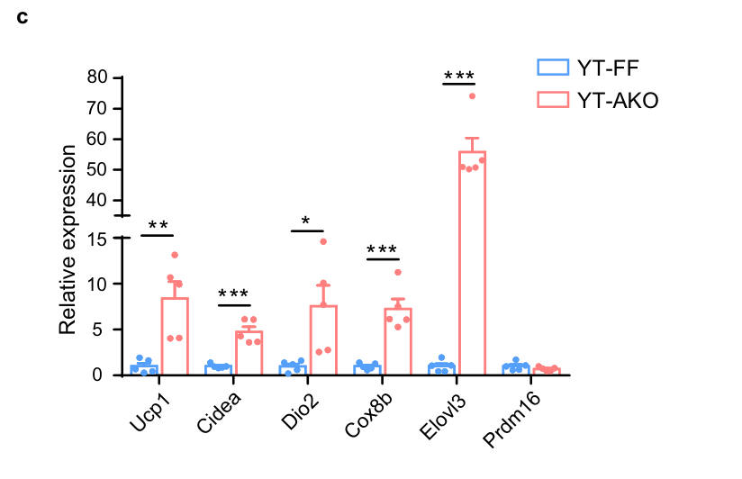
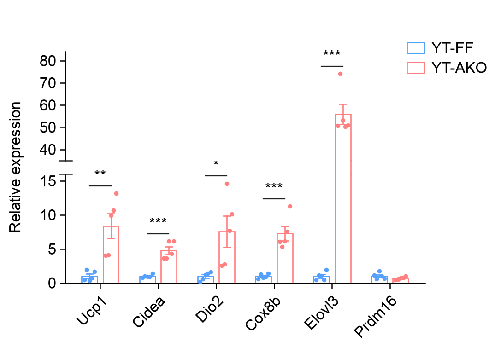

<div align="center">


# EasyViz

**Scientific plotting guided by data and literature.**

</div>

EasyViz guides local Agents that can run Python and inspect images, from data
or references to editable scientific figures.

[Latest stable release](https://github.com/idealstarry/EasyViz/releases/latest).

| Track | Start with | The Agent does |
| --- | --- | --- |
| **Create** | Data and a scientific question | Choose a useful chart, apply suitable design and review the image. |
| **Reproduce** | A reference image and your data | Read the reference, implement its layers and compare the result. |

Receive SVG by default, a separate caption and an editable `.ev` project with
code and declared plotting data at your chosen size and typography. Request
PDF, PNG or TIFF when needed.

## Install

Give your Agent this request:

```text
Install or update https://github.com/idealstarry/EasyViz in my local
ChatGPT Desktop. Follow INSTALL.md and verify the installation for me.
```

Other local Agents: [INSTALL.md](INSTALL.md).
Start a new chat after installing or updating.

## Use

**Create**

```text
Use EasyViz to inspect /path/to/my-data and recommend useful figures.
Use an 80 × 70 mm panel and 8 pt text. Inspect and refine the actual images
before delivery, export SVG and an editable .ev project, and save a separate caption.
```

**Reproduce**

```text
Use EasyViz to reproduce this reference with my measurements.csv.
Keep its layers and axis structure, use a 100 × 76 mm panel and 8 pt text,
and write plotting code for any unsupported layers. Export SVG and an editable .ev project.
```

The Agent establishes the question and experimental units, selects suitable
literature mechanisms, and reviews the actual images. Adopted statistical
results remain bound to the plotted comparison during cosmetic edits.

## Examples

### Create

**Compartment response** · 88 Ccl2 observations, mean ± SEM and separate units.
[Data and code](examples/create/compartment-ccl2/README.md).

<p align="center"><a href="examples/create/compartment-ccl2/"></a></p>

**Expression and genotype contrasts** · 174 TPM values and an aligned
descriptive comparison. [Data and code](examples/create/thermogenic-expression/README.md).

<p align="center"><a href="examples/create/thermogenic-expression/"></a></p>

**Signature relationships** · Gene overlaps, paired coefficients and
descriptive sign fractions. [Data and code](examples/create/pathway-signatures/README.md).

<p align="center"><a href="examples/create/pathway-signatures/"></a></p>

[Replicate treatment bars](examples/create/repair-outcomes/README.md),
[basic panels and other cases](examples/README.md) cover simpler questions.

### Reproduce

**Paired effect lanes** · Original Figure 3a,b from
[Vabistsevits et al., Nature Communications (2024)](https://doi.org/10.1038/s41467-024-48105-7).

| Original literature panel | EasyViz reconstruction |
| --- | --- |
|  | <a href="examples/no-author-code/vabistsevits-forest/revision-v0.4.6/"></a> |

[Data, code and declared adaptations](examples/no-author-code/vabistsevits-forest/revision-v0.4.6/README.md).

**Integration rates** · The selected depot radar from
[Massier et al., Nature Communications (2023)](https://doi.org/10.1038/s41467-023-36983-2).

| Original literature panel | EasyViz reconstruction |
| --- | --- |
|  | <a href="examples/no-author-code/massier-integration-radar/revision-v0.4.6/"></a> |

[Data, code and declared adaptations](examples/no-author-code/massier-integration-radar/revision-v0.4.6/README.md).

**Broken-axis replicate bars** · Figure 2c from
[Huang et al., Nature Communications (2023)](https://doi.org/10.1038/s41467-023-43021-8).

| Original literature panel | EasyViz reconstruction |
| --- | --- |
|  | <a href="examples/reproduce/scwat-broken-axis/"></a> |

[Data, code and declared adaptations](examples/reproduce/scwat-broken-axis/README.md).

These reconstructions retain all selected supplied values and adopt editable 8 pt text.
Their case pages record measured geometry, intentional changes and remaining
differences.
The original excerpts are [CC BY 4.0](https://creativecommons.org/licenses/by/4.0/).
[Time-course reproduction](examples/no-author-code/shi-timecourse/README.md) is also available.

Published Source Data or author code is optional for your own reproduction.
[Browse all cases](examples/README.md).

## Colors

Choose a palette for the marks and scientific meaning. Defaults are editable.

| Use | Palette | Preview |
| --- | --- | --- |
| Summary areas with dark boundaries | `progeny-summary` |  |
| Two observation classes | `scwat-blue-pink` |  |
| Increasing magnitude | `somerville-sky` |  |
| Values around an adopted center | `scwat-blue-white-coral` |  |

[All palettes, HEX values and literature sources](docs/palettes.md).

## Local workbench

Ask your Agent to use EasyViz to create, reproduce or edit a figure. After the
first validated SVG and `.ev` project are ready, it opens the workbench by
default and provides the local address. Ask for files only to skip the browser.
To open the project library before plotting:

```text
Open the EasyViz workbench for this project.
```

Use the local page at `http://127.0.0.1:PORT/` to annotate figures, and the
original Agent chat to apply your edits:

1. Choose a registered figure or import a valid `.ev` project.
2. Select SVG elements or draw numbered regions, write a comment for each,
   then click **Save drafts** to save all completed comments together.
3. Return to the **same chat that created the figure** and send:

   ```text
   Apply the saved EasyViz workbench comments to this figure.
   Update its plotting code, render a fresh attempt and review the result.
   ```

4. The Agent reads the saved comments directly; no copying or retyping is
   needed. Compare the new attempt in the workbench, accept it or request
   another round of changes. An accepted version can be restored later.

With an original Agent connected and actively waiting through
[MCP](skills/easyviz/references/mcp.md), **Submit edits** can hand off the comments
without another chat message. After that Agent's turn ends, use step 3 unless
a supported host's scheduled continuation has been configured and verified.
Saving comments alone does not start an idle Agent.

The editable canvas uses mapped SVG elements; raster layers remain raster.
PDF and PNG are additional exports. Click the figure name to rename it; the
`.ev` project and Agent context keep that name.
[Workbench guide](skills/easyviz/references/figure-workbench.md) ·
[Optional scheduled checks](skills/easyviz/references/session-trigger.md).

For MCP setup, ask your Agent to follow [INSTALL.md](INSTALL.md). A separate
Codex worker is available only when explicitly requested; importing an `.ev`
project alone does not run its code.

## Guides

[Chart library](skills/easyviz/references/chart-library.md) ·
[Data exploration and analysis](skills/easyviz/references/data-exploration.md) ·
[First Create delivery](skills/easyviz/references/first-draft.md) ·
[Reference to code](skills/easyviz/references/reference-to-code.md) ·
[Development](docs/development.md) ·
[Validation and limits](docs/validation-v0.5.1.md)

Original code and documentation: [MIT](LICENSE).
Third-party materials retain their own terms; see [source attribution](THIRD_PARTY_NOTICES.md).
