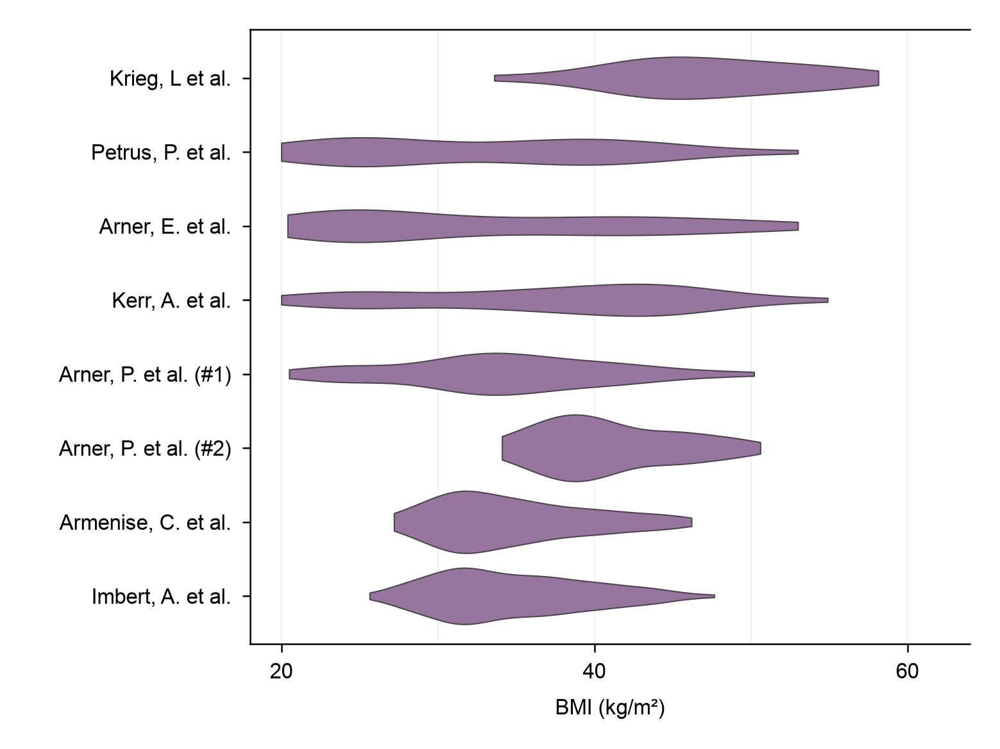
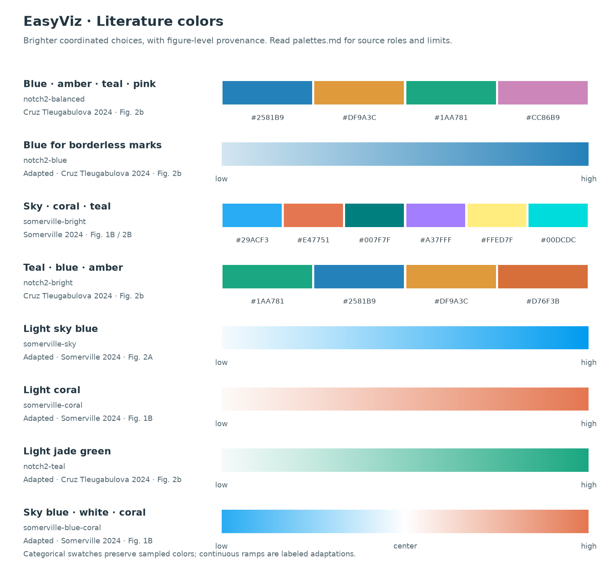

<div align="center">

# EasyViz

**Scientific panels, ready to place in a manuscript.**

Source data · Create & reproduce · Consistent typography · Individual exports

[Showcase](#showcase) · [Use](#use) · [Setup](#local-setup) · [Design](#design) · [Validation](docs/acceptance.md)

</div>

## Why EasyViz

A scientific plotting skill should help the Agent decide what the reader needs to compare, how to organize the data visually, and which design to retain. EasyViz is developing this decision support through source-backed examples and competing designs, alongside its data contracts and final-size exports. Engineering tests verify correctness; they do not establish visual quality.

EasyViz starts with your **source data**, helps choose or reproduce a chart, performs appropriate supporting statistics, and exports each panel at its intended manuscript size. You arrange the panels at their recorded dimensions; the typography stays consistent.

| You provide | EasyViz provides |
| --- | --- |
| Source data and its meaning | Checked mappings, traceable transformations, and suitable statistics |
| A chart type, scientific question, or reference image | **Create** and **reproduce** workflows |
| Requested additions and export formats | Palette choices, editable scripts, and reproducible settings |
| Figure constraints, when available | Physical panel dimensions, font settings, and inspected exports |

## Showcase

### Create — choose a design for the reading task

[Paired myeloid remodeling](examples/create/paired-myeloid-remodeling/) compares three designs using the same **832 paired score changes from 52 participants**, 16 subtypes, and two cohorts. Each scientific output is one **180 × 125 mm, 8 pt** panel; the combined preview below is documentation only.

[](examples/create/paired-myeloid-remodeling/)

The [independent comparison](evals/design-value/paired-comparison.md) found no single winner: the ledger modestly helps compare cohort distributions, the matrix uniquely preserves participant correspondence across subtypes, and the baseline gives individual values more space and precision. The same script also handles **592 five-year changes in the Kerr cohort**; this is a same-study transfer, not evidence for arbitrary datasets or design superiority.

### More create examples

These examples use annotations and aligned summaries to answer specific data questions. They are single integrated charts, exported individually. Click a preview for the data, script, settings, and checks.

<table>
<tr>
<td width="50%" align="center"><a href="examples/create/annotated-inhibition/"></a></td>
<td width="50%" align="center"><a href="examples/create/cell-atlas-dotplot/"></a></td>
</tr>
<tr>
<td><strong>Annotated inhibition matrix</strong><br>20 × 20 selected view of a 76 × 76 matrix; genome-status strips and means across the full source matrix.<br>180 × 160 mm · 8 pt</td>
<td><strong>Cell atlas composition</strong><br>16 myeloid subtypes across 3 depots; count by area, within-depot percentage by color, and aligned subtype totals.<br>180 × 120 mm · 8 pt</td>
</tr>
</table>

### Reproduce — reference image + source data, no author code

An independent reader describes the reference before implementation. A second agent checks the rendered result. Unknown original settings remain explicit assumptions; these are visual reconstructions with documented adaptations.

<table>
<tr>
<td width="50%" align="center"><a href="examples/no-author-code/massier-bmi-violin/"></a></td>
<td width="50%" align="center"><a href="examples/no-author-code/massier-integration-radar/"></a></td>
</tr>
<tr>
<td><strong>Cohort BMI distributions</strong><br>858 available BMI observations; 6 missing values recorded. KDE choices are documented.<br>132 × 99 mm · 8 pt</td>
<td><strong>Integration comparison</strong><br>All 25 supplied rates retained, including 3 zeros. An explicit radial origin replaces unknown reference padding.<br>88 × 88 mm · 8 pt</td>
</tr>
</table>

The [example catalog](examples/README.md) distinguishes these cases from the two historical examples that used author-code evidence. Small synthetic charts live in [evaluation fixtures](evals/README.md); they exercise renderer behavior.

### Transfer — synthetic source data, custom geometry

The [cohort-effect forest example](examples/create/paired-effects/) tests a new chart beyond the core renderer's five families. It preserves 28 supplied estimates and asymmetric confidence intervals; the same implementation also handles a five-term, three-cohort table with renamed fields. These are synthetic evaluation data, not biological findings.

[](examples/create/paired-effects/)

## Color choices

Compare [figure-sourced palettes](skills/easyviz/references/palettes.md) on the actual panel. The cell-atlas example uses the user-selected blue/amber/teal/pink combination, with consistent borderless marks and legend symbols. Paper provenance and visual suitability are separate considerations; derived continuous ramps are labeled as adaptations.

[](skills/easyviz/references/palettes.md)

## Use

Describe the data, intended chart or reference, requested additions, and export formats. Existing panel settings take priority over defaults.

The `$easyviz` shorthand assumes the skill is discoverable in your Codex environment. For an uninstalled checkout, build the package and give the Agent the absolute path to `dist/easyviz/skills/easyviz/SKILL.md`, asking it to read and use that skill. This explicit-path workflow is included in the release QA; building the ZIP alone does not register a plugin in Codex.

```text
Use $easyviz to create an annotated heatmap from this source matrix.
Add the supplied sample annotations and marginal means. Use a sequential
palette, 180 × 160 mm, Arial 8 pt, and export PDF, SVG, and PNG.
```

```text
Use $easyviz to reproduce this reference with my source data, without
looking for author code. Keep the chart structure and category order,
use our existing colors, and export one 88 × 88 mm panel.
```

```text
Add sample-level points and a paired comparison to this panel.
Keep its accepted dimensions, font sizes, and color mapping.
```

Panel artwork defaults to no overall title, subtitle or narrative footnote. Such text belongs in the separate manuscript caption; axes, legends and essential data annotations stay in the panel.

The output includes the panel, a separate caption, a runnable script, actual settings, plotting data or traceable input references, statistics when used, and review findings. Bioinformatics software analysis stays with the upstream Agent.

## Local setup

This repository is a local development distribution. The build creates a portable plugin folder and ZIP containing all three skills:

```sh
python3 -m venv .venv
.venv/bin/python -m pip install -r requirements-dev.txt
.venv/bin/python scripts/build_plugin.py
```

The pinned environment requires Python 3.12 or later and was validated with Python 3.12. The generated plugin is in `dist/easyviz/`. See its [package guide](plugins/easyviz/README.md) for the runtime and resource entry points. Building does not install the plugin or publish it to a marketplace.

For a quick renderer check:

```sh
.venv/bin/python skills/easyviz/scripts/render.py \
  --data skills/easyviz/assets/fixtures/heatmap/data.csv \
  --spec skills/easyviz/assets/fixtures/heatmap/spec.json \
  --out /tmp/easyviz-heatmap
```

## Design

| Part | Responsibility |
| --- | --- |
| [EasyViz](skills/easyviz/SKILL.md) | Select the track, resolve scientific and layout decisions, render, and deliver |
| [Reference Reader](skills/easyviz-reference-reader/SKILL.md) | Describe image evidence independently, before seeing implementation templates |
| [Figure Reviewer](skills/easyviz-figure-reviewer/SKILL.md) | Compare actual renders with the adopted requirements and reference |
| [Design decisions](skills/easyviz/references/design-decisions.md) | Choose among competing layouts using the scientific reading task and observed tradeoffs |
| [Panel layout](skills/easyviz/references/panel-layout.md) | Keep final canvas dimensions and agreed font sizes across exports |
| [Legend layout](skills/easyviz/references/legend-layout.md) | Measure complete guides, compare placement, and protect quantitative mappings |
| [Palettes](skills/easyviz/references/palettes.md) | Choose categorical, sequential, or diverging colors with explicit mappings |
| [Chart library](skills/easyviz/references/chart-library.md) | Reuse a compatible recipe or write the required geometry |

Create and reproduce share the same data, typography, export, and visual-review standards. More layers are useful only when they carry information. Defaults are adjustable starting values, not journal requirements.

[Measurements from published figures](docs/legend-literature.md) inform legend placement and proportion. EasyViz retains agreed type sizes, measures the complete key and label footprint, and reviews the space given to the data. A fitting legend still needs a visual hierarchy check.

## Repository

```text
skills/             Main skill, focused helper skills, and portable resources
plugins/easyviz/    Plugin manifest and links to the canonical skill sources
examples/           Real-data create and reproduce cases, with provenance
evals/             Synthetic fixtures, isolated reference inputs, and evaluations
scripts/            Development, rendering, and packaging helpers
tests/              Numerical, statistical, export, and portability checks
docs/               Development guide and acceptance evidence
```

See [development](docs/development.md) for rerunning examples and extending the library, [acceptance results](docs/acceptance.md) for checks performed, and [generalization evidence](docs/generalization.md) for the distinction between reusable rules, supported code and case-specific layouts. The README and directory organization take structural inspiration from [Kami](https://github.com/tw93/Kami).

## Sources and terms

Real-data examples retain their source attribution and transformations. See [THIRD_PARTY_NOTICES.md](THIRD_PARTY_NOTICES.md). Restricted or unverified historical materials are excluded from the portable plugin. No distribution license has yet been selected for original EasyViz code.
