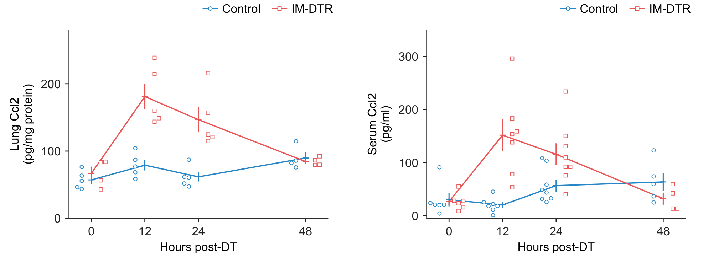
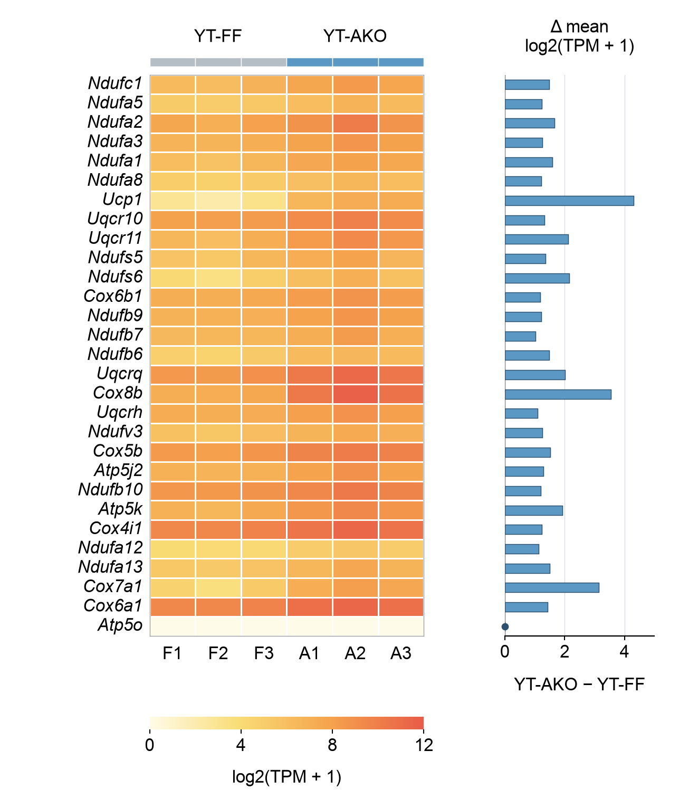
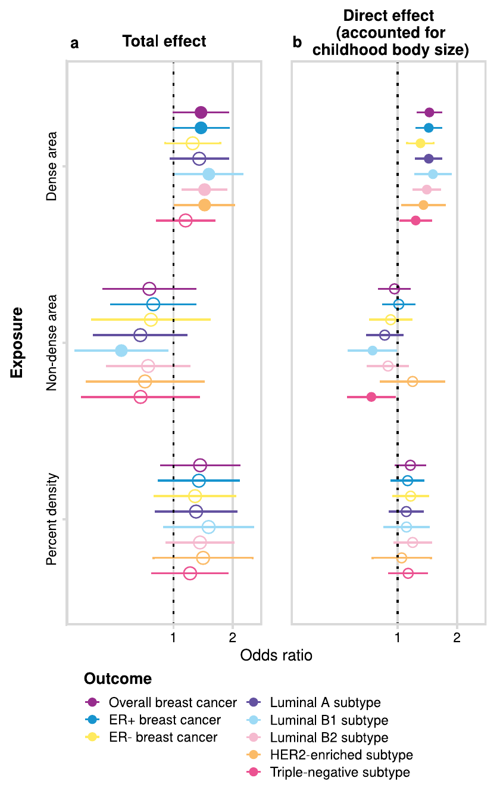
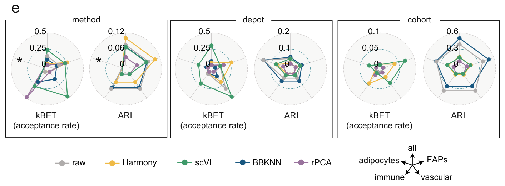
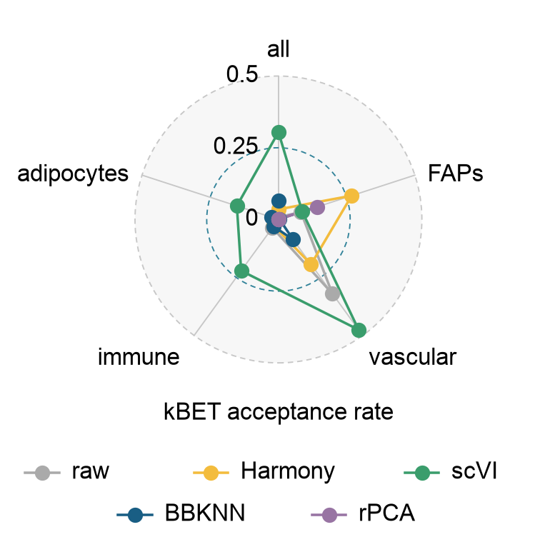

<div align="center">


# EasyViz

**Scientific plotting guided by data and literature.**

</div>

EasyViz guides local Agents that can run Python and inspect images, from data
or references to editable scientific figures.

[Latest stable release](https://github.com/idealstarry/EasyViz/releases/latest).

| Track | Start with | The Agent does |
| --- | --- | --- |
| **Create** | Data and a scientific question | Choose a useful chart, apply suitable design and review the image. |
| **Reproduce** | A reference image and your data | Read the reference, implement its layers and compare the result. |

Receive PDF, SVG and PNG, a caption, code and plotting data at your chosen size
and typography.

## Install

Give your Agent this request:

```text
Install or update https://github.com/idealstarry/EasyViz in my local
ChatGPT Desktop. Follow INSTALL.md and verify the installation for me.
```

Other local Agents: [INSTALL.md](INSTALL.md).
Start a new chat after installing or updating.

## Use

**Create**

```text
Use EasyViz to inspect /path/to/my-data and recommend useful figures.
Use an 80 × 70 mm panel and 8 pt text. Inspect and refine the actual images
before delivery, export PDF, SVG and PNG, and save a separate caption.
```

**Reproduce**

```text
Use EasyViz to reproduce this reference with my measurements.csv.
Keep its layers and axis structure, use a 100 × 76 mm panel and 8 pt text,
and write plotting code for any unsupported layers. Export PDF, SVG and PNG.
```

The Agent clarifies units and comparisons, applies suitable
[design cards](skills/easyviz/references/design-cards.md), and reviews actual images.

## Examples

### Create

**Compartment response** · 88 Ccl2 observations, mean ± SEM and separate units.
[Data and code](examples/create/compartment-ccl2/README.md).

<p align="center"><a href="examples/create/compartment-ccl2/"></a></p>

**Expression and genotype contrasts** · 174 TPM values and an aligned
descriptive comparison. [Data and code](examples/create/thermogenic-expression/README.md).

<p align="center"><a href="examples/create/thermogenic-expression/"></a></p>

**Signature relationships** · Gene overlaps, paired coefficients and
descriptive sign fractions. [Data and code](examples/create/pathway-signatures/README.md).

<p align="center"><a href="examples/create/pathway-signatures/"></a></p>

[Replicate treatment bars](examples/create/repair-outcomes/README.md),
[basic panels and other cases](examples/README.md) cover simpler questions.

### Reproduce

**Paired effect lanes** · Original Figure 3a,b from
[Vabistsevits et al., Nature Communications (2024)](https://doi.org/10.1038/s41467-024-48105-7).

| Original literature panel | EasyViz reconstruction |
| --- | --- |
|  | <a href="examples/no-author-code/vabistsevits-forest/revision-v0.4.6/"></a> |

[Data, code and declared adaptations](examples/no-author-code/vabistsevits-forest/revision-v0.4.6/README.md).

**Integration rates** · The selected depot radar from
[Massier et al., Nature Communications (2023)](https://doi.org/10.1038/s41467-023-36983-2).

| Original literature panel | EasyViz reconstruction |
| --- | --- |
|  | <a href="examples/no-author-code/massier-integration-radar/revision-v0.4.6/"></a> |

[Data, code and declared adaptations](examples/no-author-code/massier-integration-radar/revision-v0.4.6/README.md).

Both reconstructions retain all supplied values and adopt editable 8 pt text.
Their case pages record measured geometry, intentional changes and remaining
differences.
Both original excerpts are [CC BY 4.0](https://creativecommons.org/licenses/by/4.0/).
[Time-course reproduction](examples/no-author-code/shi-timecourse/README.md) is also available.

Published Source Data or author code is optional for your own reproduction.
[Browse all cases](examples/README.md).

## Colors

Choose a palette for the marks and scientific meaning. Defaults are editable.

| Use | Palette | Preview |
| --- | --- | --- |
| Summary areas with dark boundaries | `progeny-summary` |  |
| Two observation classes | `scwat-blue-pink` |  |
| Increasing magnitude | `somerville-sky` |  |
| Values around an adopted center | `scwat-blue-white-coral` |  |

[All palettes, HEX values and literature sources](docs/palettes.md).

## Local figure review

```text
Open the EasyViz local figure workbench for this panel.
Let me select elements or draw numbered regions and save my instructions.
When I say the requests are ready, apply them and show the new attempt
beside the previous one.
```

The Agent opens `http://127.0.0.1:PORT/`. Add numbered selections or regions,
write instructions, and **Save requests**. Tell the Agent to apply them; it
edits the code and shows the new attempt beside the previous one. Saving alone
does not start the Agent. Element selection needs a matching element map;
custom plots can use the documented export handoff.
[Workbench guide](skills/easyviz/references/figure-workbench.md).

## Guides

[Chart library](skills/easyviz/references/chart-library.md) ·
[Data exploration and analysis](skills/easyviz/references/data-exploration.md) ·
[First Create delivery](skills/easyviz/references/first-draft.md) ·
[Reference to code](skills/easyviz/references/reference-to-code.md) ·
[Development](docs/development.md) ·
[Validation and limits](evals/release-qa/v0.4.6/README.md)

Original code and documentation: [MIT](LICENSE).
Third-party materials retain their own terms; see [source attribution](THIRD_PARTY_NOTICES.md).
