<div align="center">


# EasyViz

**Scientific panels, ready for your manuscript.**

</div>

EasyViz helps an Agent turn prepared source data into clear scientific figures. Choose a chart or supply a reference, select a palette and export format, and get a reproducible panel at its final manuscript size.

| Track | Input | Approach |
| --- | --- | --- |
| **Create** | A data directory or prepared tables, with an optional chart type or scientific question | Inspect the data, recommend useful views, and use an adopted analysis plan when summaries or comparisons are needed. |
| **Reproduce** | A reference image and your source data | Read the visual structure independently, implement it from your data, and check the result. New plotting code can cover unfamiliar layers. |

Palettes, proportions, dimensions and fonts are configurable. Each panel is exported separately for assembly at its recorded size. General statistics are supported; upstream bioinformatics analysis stays outside the Skill. Explanatory prose belongs in the accompanying caption.

Related panels can share a [figure profile](skills/easyviz/references/figure-profile.md) so category colors, typography and quantitative scales stay consistent. Dot plots distinguish [measured zero, unmeasured and absent data](skills/easyviz/references/dot-states.md) without changing proportional dot areas. Unknown configuration fields fail with a correction hint.

For a first panel, the Agent can [generate a validated specification](skills/easyviz/references/quick-start.md) from explicit column meanings and use measured layout to fit labels and legends inside the requested canvas. Dense heatmap value labels are checked against their cells. These helpers reduce repeated configuration work; actual image review still determines readability and balance.

A directory is enough to begin [create exploration](skills/easyviz/references/data-exploration.md): the Agent inventories CSV, TSV or XLSX tables and proposes a few concrete figures. [Planned analysis](skills/easyviz/references/statistical-analysis.md) records experimental units, comparisons, effects, supported intervals and any multiplicity adjustment separately from styling. Reproduce starts from the reference and your data; the paper need not publish Source Data or author code. [Reference to code](skills/easyviz/references/reference-to-code.md) supports an explicit implementation when a recipe does not fit.

Choose a view for the question the reader needs to answer:

| Reading task | Available views |
| --- | --- |
| Compare values or compositions across categories | Heatmap, dot plot, stacked composition, annotated matrix with aligned margins |
| Compare raw distributions | Box/violin with points, median/IQR swarms, empirical cumulative distributions (ECDF) |
| Follow measurements from the same unit | Paired or repeated-condition points with optional connectors, participant correspondence matrix |
| Compare components and replicate variation | Stacked or grouped component bars with raw observations and explicitly defined SD; separate supplied-ratio summaries |
| Compare supplied coordinates or estimated effects | Scatter with optional proportional circle area; linear/log forest plots with supplied asymmetric intervals |
| Follow supplied time or dose summaries | Mean lines with supplied SD or explicit lower/upper bands; one y axis or an adopted two-axis view |

The [chart library](skills/easyviz/references/chart-library.md) links the input
contracts and reusable scripts. Specialized views preserve their scientific
definitions rather than treating every table as interchangeable.

## Examples

**Create · paired myeloid changes**

Three designs for the same 832 paired changes: individual values, cohort distributions, and participant correspondence.

<p align="center"><a href="examples/create/paired-myeloid-remodeling/">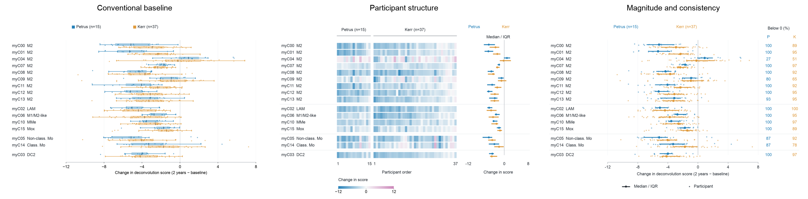</a></p>

**Create · annotated inhibition matrix**

Genome-status annotations and full-matrix summaries accompany a selected 20 × 20 view.

<p align="center"><a href="examples/create/annotated-inhibition/">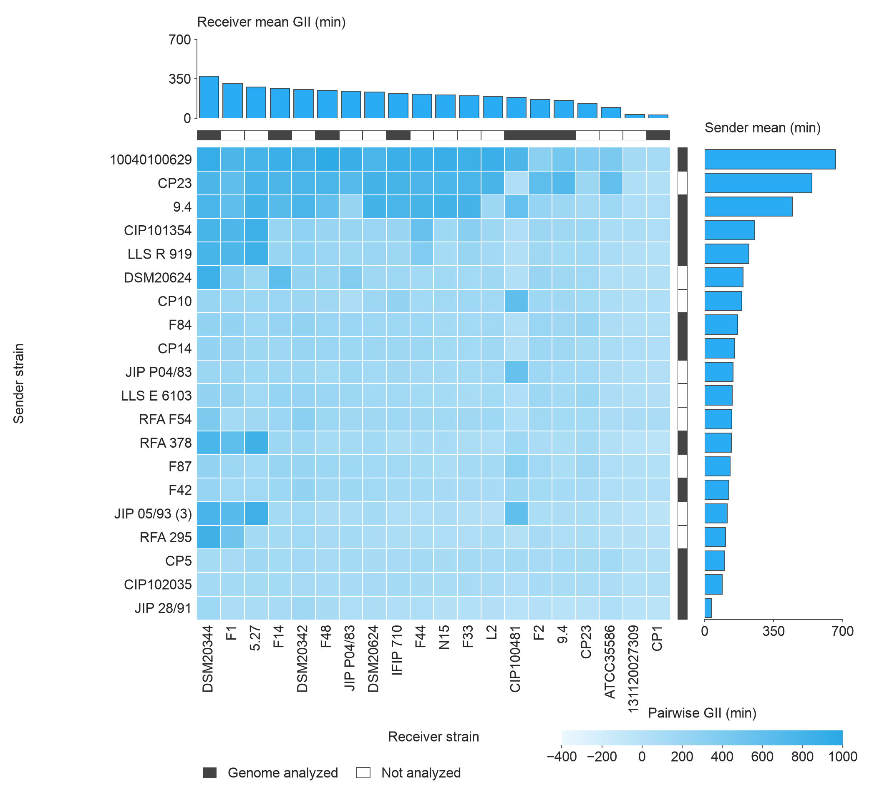</a></p>

**Create · cell atlas composition**

Counts, within-depot proportions, and aligned totals for 16 myeloid subtypes across three depots.

<p align="center"><a href="examples/create/cell-atlas-dotplot/">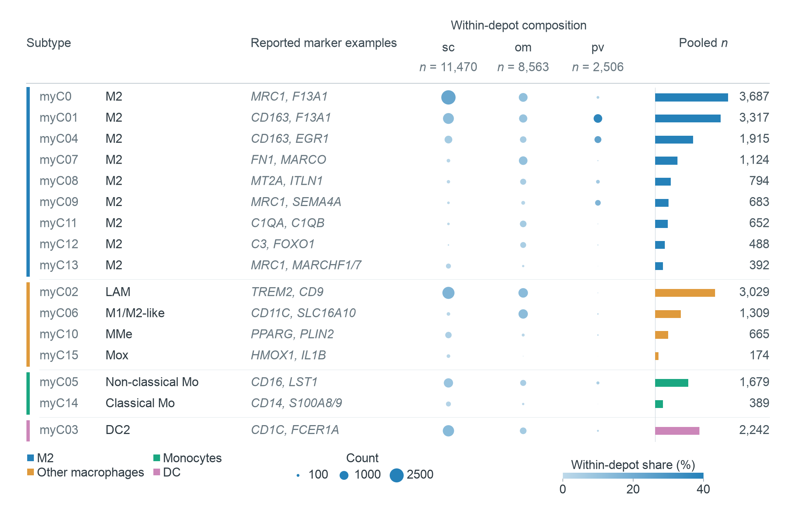</a></p>

**Create · cohort effects**

Supplied estimates and asymmetric confidence intervals; synthetic data demonstrate custom geometry and field mapping.

<p align="center"><a href="examples/create/paired-effects/">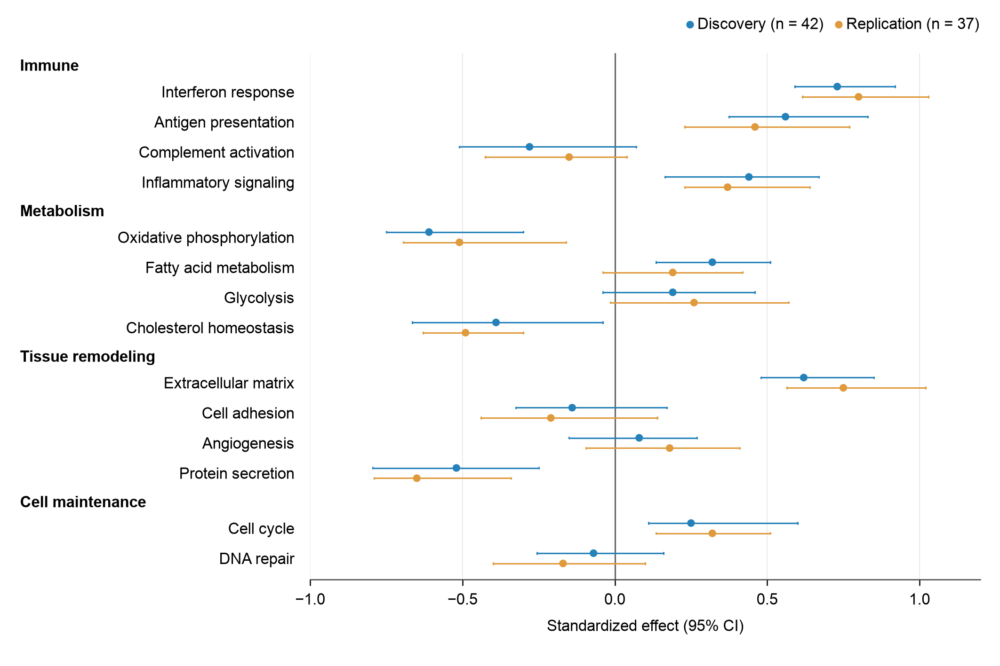</a></p>

**Reproduce · integration comparison**

Five methods across five cell classes, reconstructed from a reference image and source data without author code. All 25 rates, including three zeros, are retained.

<p align="center"><a href="examples/no-author-code/massier-integration-radar/">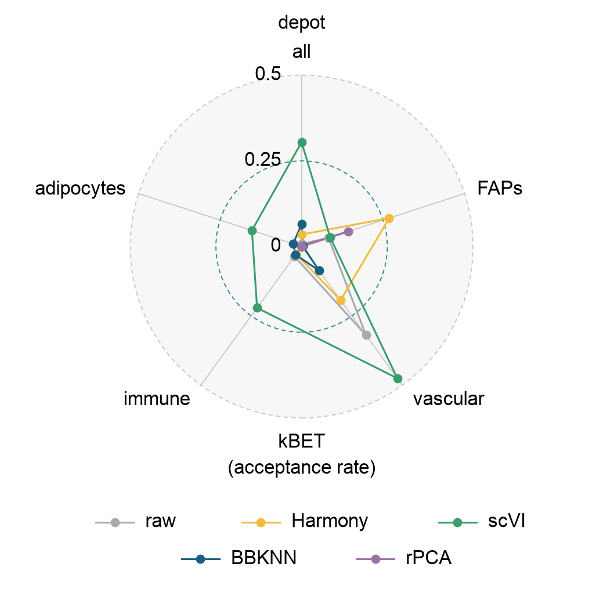</a></p>

**Reproduce · Nature Communications Source Data**

Two additional papers become reusable implementations: supplied coordinates with proportional circle area, and supplied estimates with asymmetric intervals on a log axis. All source rows are retained; zero sizes, source filtering and unknown sample sizes are recorded explicitly.

<p align="center"><a href="examples/no-author-code/xiang-bubble-volcano/">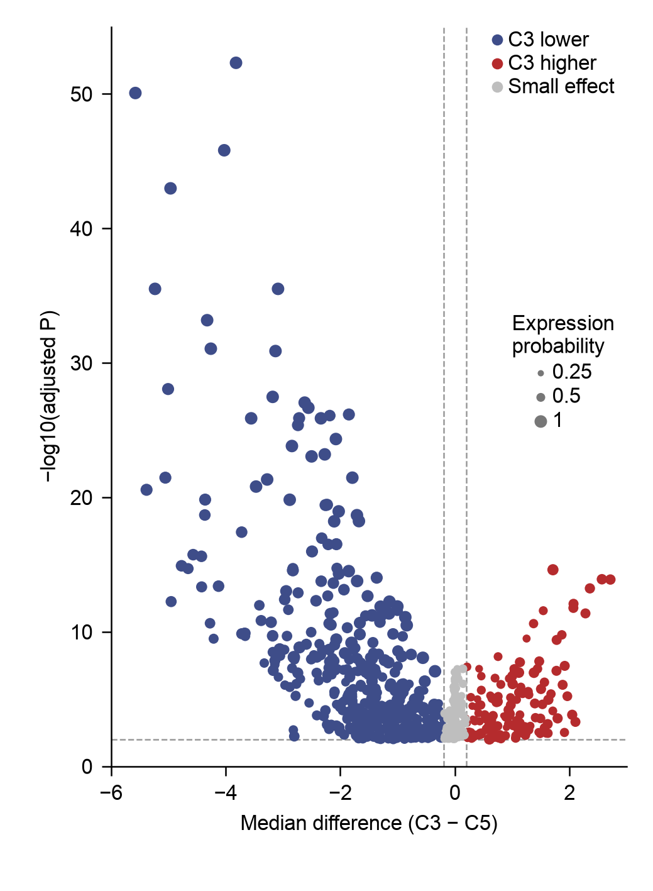</a> <a href="examples/no-author-code/vabistsevits-forest/">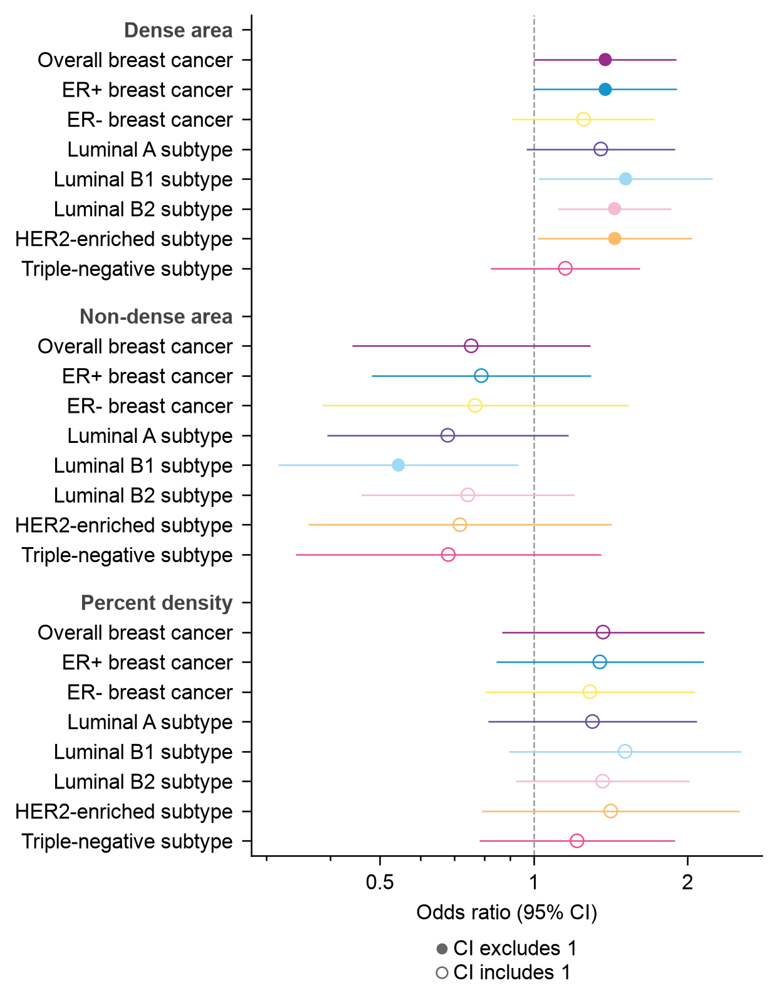</a></p>

[Literature Source Data workflow and candidate queue](skills/easyviz/references/literature-source-data.md) · [Generic supplied-interval script](skills/easyviz/references/interval-plot.md)

**Observations and components · two more Source Data papers**

Urschel's 127 complete before/after pairs support a log-scale median/IQR swarm,
an optional connected view, and a new ECDF of all 254 observations. Truong's
Nature Methods data supply 7 conditions × 3 replicates: component stacks,
grouped component comparisons, and a separate supplied-ratio panel. Raw
observations and true zeros are retained; each summary states what it measures.

<p align="center"><a href="examples/no-author-code/urschel-paired/">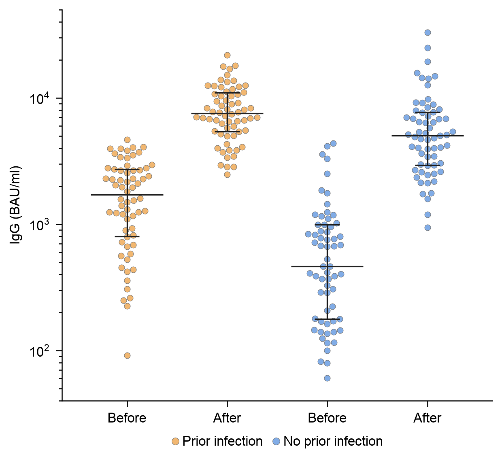</a> <a href="examples/create/urschel-ecdf/">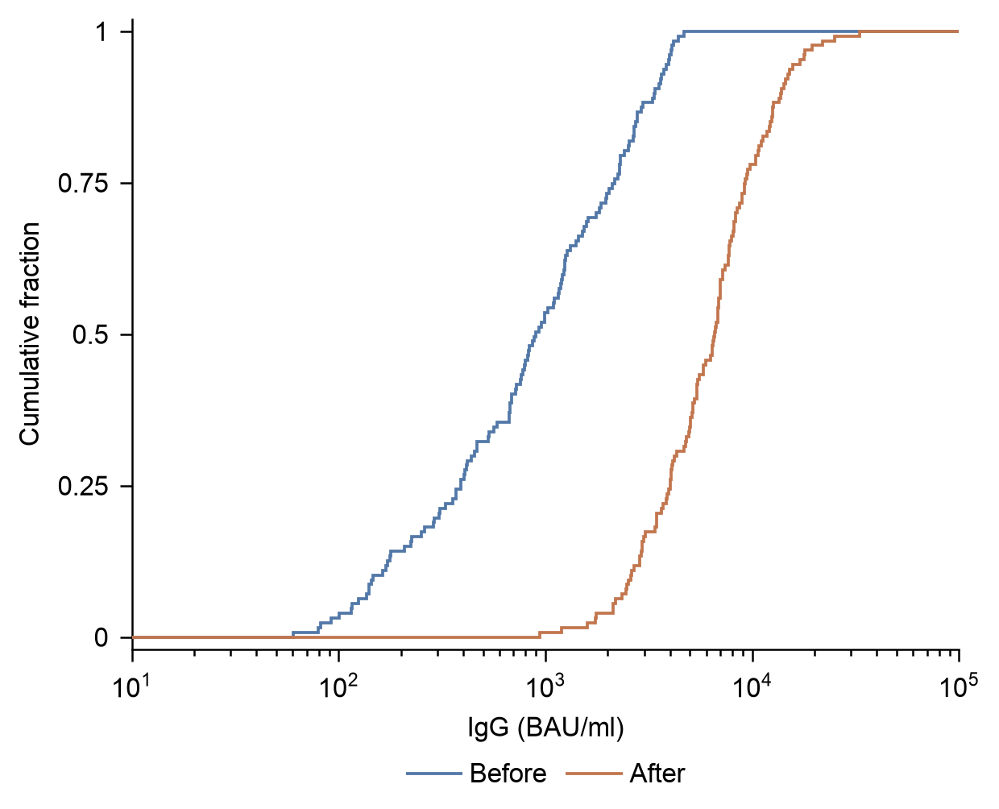</a></p>

<p align="center"><a href="examples/no-author-code/truong-components/">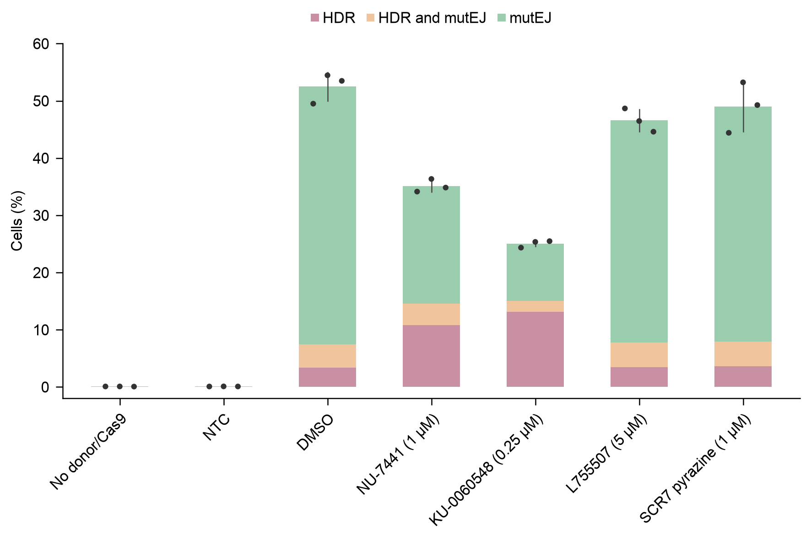</a></p>

These are auditable, configurable implementations. The swarm follows the
published structure with recorded differences; the ECDF and separate component
views are explicitly new designs. They demonstrate specific aesthetic and data
choices, rather than establishing a universal journal style.

**Reproduce · supplied time-course summaries**

Shi's Nature Communications Figure 1d supplies width and length means and SD at 60 time points. The reconstruction retains all 120 summaries, colored y axes and uncertainty bands. Its expanded bounds preserve the full SD bands; a changed-data reproduction and a separate synthetic dose view exercise the [time-course recipe](skills/easyviz/references/timecourse-plot.md).

<p align="center"><a href="examples/no-author-code/shi-timecourse/">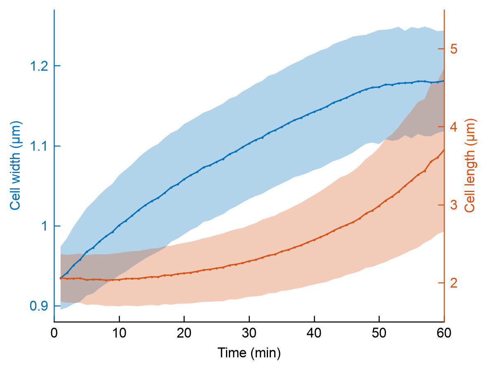</a></p>

[Browse all examples](examples/README.md) · [Design decisions](skills/easyviz/references/design-decisions.md)

**Palette choices**

Choose a preset by name. The color previews below contain only swatches;
names, HEX values and sources are selectable text.

| Palette | Color preview |
| --- | --- |
| **Blue · amber · teal · pink**<br>`notch2-balanced` · categorical<br>[Cruz Tleugabulova 2024 · Fig. 2b](https://www.nature.com/articles/s41467-024-53700-9) | <br>`#2581B9` `#DF9A3C` `#1AA781` `#CC86B9` |
| **Blue for borderless marks**<br>`notch2-blue` · sequential<br>Adapted · [Cruz Tleugabulova 2024 · Fig. 2b](https://www.nature.com/articles/s41467-024-53700-9) | <br>low `#D3E6F1` → high `#2581B9` |
| **Sky · coral · teal**<br>`somerville-bright` · categorical<br>[Somerville 2024 · Fig. 1B / 2B](https://www.nature.com/articles/s41467-024-52687-7) | <br>`#29ACF3` `#E47751` `#007F7F` `#A37FFF` `#FFED7F` `#00DCDC` |
| **Teal · blue · amber**<br>`notch2-bright` · categorical<br>[Cruz Tleugabulova 2024 · Fig. 2b](https://www.nature.com/articles/s41467-024-53700-9) | <br>`#1AA781` `#2581B9` `#DF9A3C` `#D76F3B` |
| **Light sky blue**<br>`somerville-sky` · sequential<br>Adapted · [Somerville 2024 · Fig. 2A](https://www.nature.com/articles/s41467-024-52687-7) | <br>low `#F5FBFE` → high `#009CF0` |
| **Light coral**<br>`somerville-coral` · sequential<br>Adapted · [Somerville 2024 · Fig. 1B](https://www.nature.com/articles/s41467-024-52687-7) | <br>low `#FEFAF8` → high `#E47751` |
| **Light jade green**<br>`notch2-teal` · sequential<br>Adapted · [Cruz Tleugabulova 2024 · Fig. 2b](https://www.nature.com/articles/s41467-024-53700-9) | <br>low `#F6FBFA` → high `#1AA781` |
| **Sky blue · white · coral**<br>`somerville-blue-coral` · diverging<br>Adapted · [Somerville 2024 · Fig. 1B](https://www.nature.com/articles/s41467-024-52687-7) | <br>low `#29ACF3` → center `#FFFFFF` → high `#E47751` |

Categorical sets select and reorder colors from the cited figures. Continuous
ramps are EasyViz adaptations. [Palette selection and provenance](skills/easyviz/references/palettes.md)
describe the extraction methods and use conditions.

## Use

For a local Agent that can run Python and inspect images, a plain request is enough:

```text
Use EasyViz to plot this dataset as a dot plot.
Put condition on the x-axis and gene on the y-axis.
Encode fraction with dot area and mean_score with color.
Use a 120 × 90 mm panel and 8 pt text.
Retain all data, inspect the rendered figure, and export PDF, SVG and PNG.
Save the figure caption in a separate file.
```

The Agent follows the [first-panel workflow](skills/easyviz/references/quick-start.md); the user need not write plotting code or JSON. Specify the scientific meaning of ambiguous columns, proportions and independent samples when needed. The Python resources are portable to local coding Agents; installation and skill discovery depend on the client.

```text
Use $easyviz to plot my source data as a dot plot.
Use blue / amber / teal / pink, Arial 8 pt, and a 180 × 120 mm panel.
Export PDF, SVG and PNG, with the caption in a separate file.
```

For an undecided directory or a reference-led panel, requests can be equally direct:

```text
Use EasyViz to inspect /path/to/my-data and recommend two or three useful figures.
Show descriptive previews first. Before tests, confirm the independent unit,
pairing and planned comparisons from my study notes.
```

```text
Use EasyViz to reproduce the attached reference with my measurements.csv.
Keep its layers and axis structure, use a 100 × 76 mm panel and 8 pt text,
and write new plotting code for any layers the recipes do not cover.
Export PDF, SVG and PNG, with a separate caption.
```

Deliverables include the individual panel, caption, runnable script, settings, plotting data and relevant checks. Literature Source Data cases provide auditable learning examples; they are not prerequisites for your own reproduction.

In create, [actual preview choices](skills/easyviz/references/preview-choices.md)
render box + all observations and ECDF views of the same data at matching
dimensions, typography, colors and value scales. Optional violin density is
explicit. The Agent selects by the reading task after inspecting the images;
unknown design remains descriptive. Repeated measurements use their own
paired contract and can use explicitly planned Friedman analysis.

For richer matrices, [annotated matrix layers](skills/easyviz/references/annotated-matrix.md)
combine keyed row/column strips, declared mean/sum marginals and supplied
dendrograms. Missing, unmeasured and measured-zero cells retain different
meanings. The shared alignment helper also supports custom stacked matrices
and supplied summary tracks; it computes no clustering.

The [Yayon Nature case](examples/no-author-code/yayon-cma/README.md) exercises
two spatial matrices and aligned cosine/P-value layers using all 1,430 supplied
numeric source cells. It explicitly omits the unpublished dendrogram. Its
changed-schema fixture checks reuse; a separately adopted wider layout supports
DejaVu Sans without shrinking the text.

For crowded raw observations, the Agent can use [physical beeswarm placement](skills/easyviz/references/collision-placement.md): spread circles along the category axis while retaining measurements, marker sizes and the agreed canvas. Unresolved packing is reported for a layout decision. [The same-data example](evals/crowding-layout/v0.4.1/README.md) records 12 overlapping pairs reduced to zero.

[Directory exploration](skills/easyviz/references/data-exploration.md) now flags suspected summary tables, repeated identifiers and ambiguous fields before proposing analysis. [Complex reproduction guidance](skills/easyviz/references/complex-reproduction.md) covers shared coordinates, ID joins, marginal summaries and separate guides, with an optional audit of recorded layer and numeric evidence. Actual image review remains part of both tracks.

The `$easyviz` shorthand requires a discoverable skill. For an uninstalled checkout, ask the Agent to read and use the absolute path to `skills/easyviz/SKILL.md`.

## Local figure review

After creating a panel in either **create** or **reproduce**, ask your Agent:

```text
Open the EasyViz local figure workbench for this panel and give me its browser URL.
Let me select elements or regions and save edit requests.
When I tell you the requests are ready, read requests.json, update the plotting
code or specification, and export a new attempt in all requested formats.
Show the previous and new attempts side by side.
```

The Agent starts a local Python server and opens or shares its
`http://127.0.0.1:PORT/` address. The page runs on demand; keep the server running
while reviewing. It requires no model API, API key or extra Python package.

| On the page | What you can do |
| --- | --- |
| **Edit** | Select mapped marks, axes, labels, legends or a whole category; alternatively, mark a canvas region. Choose a property or write an instruction such as “Make all Control marks and their legend purple” or “Move this legend 2 mm right; keep 8 pt text.” |
| **Requests** | Review saved changes and undo a pending request. Requests retain the figure and source versions in `requests.json`, which the Agent can read directly. |
| **History** | Inspect recorded attempt history, including prepared, applied, accepted and restored changes. The Agent can display an earlier attempt beside the current figure and verify acceptance or restore a source/export snapshot through the [edit-history workflow](skills/easyviz/references/apply-figure-requests.md). |

Saving a request records your instruction. Tell the Agent when you are ready
to apply the saved requests; saving alone does not notify or start the Agent.
It changes the plotting source or specification, rerenders the figure and opens
the new attempt. The page does not execute plotting code or directly edit the
PDF. Each new attempt keeps the earlier exports available for comparison.

The figure directory needs an exported `panel.svg`. A matching `elements.json`
enables selection of mapped elements and categories; without it, general and
region notes are available. Ask the Agent to prepare these files when rendering.
Scatter collections select a whole point group. Selecting one observation needs
its own source mapping. In **Select element** mode, hover to see the mapped
target and click on or near its painted mark; the page allows a 6 px tolerance.
Use the mapped-element list for crowded or overlapping targets. Fresh exports
also map visible axis lines, tick marks and tick labels.

For manual startup from a repository checkout:

```sh
python skills/easyviz/scripts/figure_workbench.py \
  --figure-dir /absolute/path/to/project/attempt-01 --port 0
```

`--port 0` chooses an available port. Add
`--compare-dir /absolute/path/to/project/previous-attempt` for side-by-side review.
See the [workbench guide](skills/easyviz/references/figure-workbench.md) for file
requirements, selection controls and the Agent handoff.

## Setup

Give your local Agent this request:

```text
Install or update https://github.com/idealstarry/EasyViz in my local
ChatGPT Desktop. Read its INSTALL.md and complete the installation for me.
```

The Agent follows [INSTALL.md](INSTALL.md) to download, install or update, and verify EasyViz. It handles the local requirements and preserves your other plugins. Start a new chat for first use; a running desktop may need to refresh or restart before showing an update.

[Release ZIPs](https://github.com/idealstarry/EasyViz/releases) are available for portable use. Building or downloading a package alone does not install it. See the [package guide](plugins/easyviz/README.md) for runtime requirements and [development guide](docs/development.md) for local builds and release checks.

## Inside

- [EasyViz](skills/easyviz/SKILL.md) — the two tracks, data choices and panel delivery.
- [Reference Reader](skills/easyviz-reference-reader/SKILL.md) — independent interpretation of a supplied image.
- [Figure Reviewer](skills/easyviz-figure-reviewer/SKILL.md) — actual-image review against the adopted requirements.

[Development](docs/development.md) · [Release QA](evals/release-qa/README.md) · [Generalization limits](docs/generalization.md)

Actual-image reviews, changed-data checks and Agent trials are documented in
[generalization evidence](docs/generalization.md). Earlier comparisons and
negative results remain in their original records; successful exports alone do
not establish visual quality or a gain across models.

## License

Original code and documentation: [MIT](LICENSE). Third-party data and reference figures retain their own terms; see [source attribution](THIRD_PARTY_NOTICES.md).
