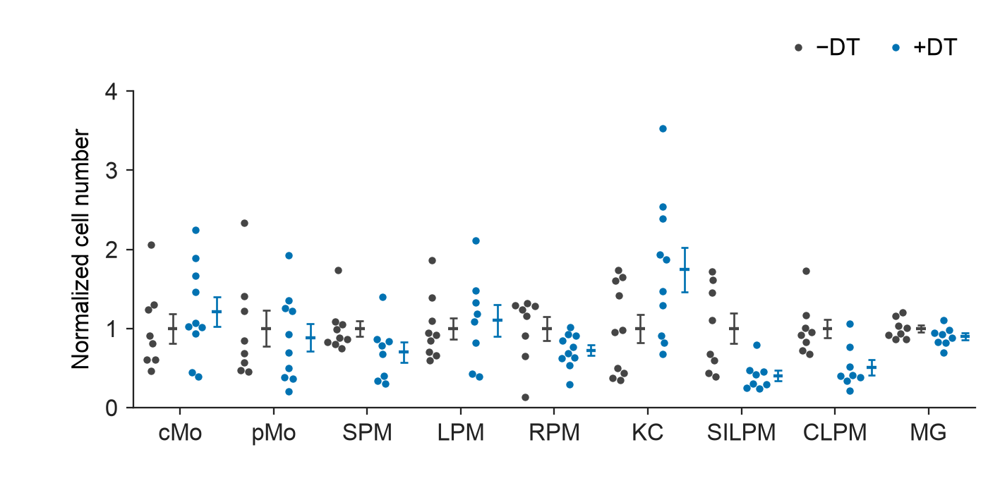
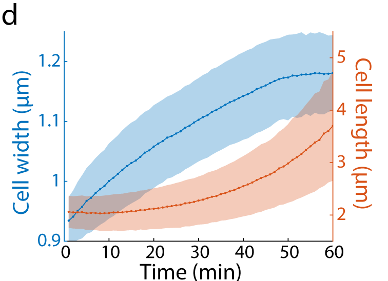

<div align="center">


# EasyViz

**Scientific plotting guided by data and literature.**

</div>

EasyViz helps a local Agent turn data into editable scientific figures, with
literature-informed design, actual image review and PDF, SVG and PNG exports.

[Latest stable release](https://github.com/idealstarry/EasyViz/releases/latest).

| Track | Start with | The Agent does |
| --- | --- | --- |
| **Create** | A data directory, table or scientific question | Recommends a suitable chart, applies scene-specific design and reviews the result before delivery. |
| **Reproduce** | A reference image and your data | Reads the visual structure, writes or adapts plotting code and checks the result against the reference. |

Set the panel size, typography and scientific choices; EasyViz keeps them
consistent. You receive the figure, a separate caption, runnable code and
traceable plotting data.

## Install

Give your Agent this request:

```text
Install or update https://github.com/idealstarry/EasyViz in my local
ChatGPT Desktop. Follow INSTALL.md and verify the installation for me.
```

For other local Agents, follow [INSTALL.md](INSTALL.md).
[Release packages](https://github.com/idealstarry/EasyViz/releases) are also available.
Start a new chat after installing or updating.

## Use

**Create**

```text
Use EasyViz to inspect /path/to/my-data and recommend useful figures.
Use an 80 × 70 mm panel and 8 pt text. Inspect and refine the actual images
before delivery, export PDF, SVG and PNG, and save a separate caption.
```

**Reproduce**

```text
Use EasyViz to reproduce this reference with my measurements.csv.
Keep its layers and axis structure, use a 100 × 76 mm panel and 8 pt text,
and write plotting code for any unsupported layers. Export PDF, SVG and PNG.
```

The Agent clarifies consequential unknowns about units, pairing or comparisons.
For a new Create panel, it uses applicable literature design rules and
[visual design cards](skills/easyviz/references/design-cards.md), then inspects
and corrects the images before the first finished delivery.

## Examples

### Create

**Treatment comparison** · One repair outcome, with every biological replicate
and sample SD. The case also exports the other outcomes separately.
[Data, code and caption](examples/create/repair-outcomes/README.md).

<p align="center"><a href="examples/create/repair-outcomes/"></a></p>

**Cell-number comparison** · Compare two treatments within nine measured
populations. Separate raw-observation and mean ± SEM lanes keep the summaries
visible. [Fresh workflow exercise, data and limitations](evals/create-purpose-overhaul-v0.4.4/fresh-run/README.md).

<p align="center"><a href="evals/create-purpose-overhaul-v0.4.4/fresh-run/README.md"></a></p>

**Composition heatmap** · Original percentages, clear cell seams and numeric
values. [Data, code and caption](examples/create/basic-panels/depot-heatmap/).

<p align="center"><a href="examples/create/basic-panels/depot-heatmap/"></a></p>

### Reproduce

**Time-course means and SD** · Original Figure 1d from
[Shi et al., Nature Communications (2021)](https://doi.org/10.1038/s41467-021-22092-5),
compared with the reconstruction from its 120 supplied summaries.

| Original literature panel | EasyViz reconstruction |
| --- | --- |
|  | <a href="examples/no-author-code/shi-timecourse/"></a> |

The reproduced panel omits the original panel letter and expands the width-axis
bounds to show the full supplied SD. Source excerpt: Shi et al.,
[CC BY 4.0](https://creativecommons.org/licenses/by/4.0/).
[Data, code and recorded differences](examples/no-author-code/shi-timecourse/README.md).
Other cases include [integration radar](examples/no-author-code/massier-integration-radar/)
and [supplied-effect forest panels](examples/no-author-code/vabistsevits-forest/).

The examples use attributed literature Source Data. Each case records its
transformations and limitations. Your own reproduction needs a reference and
your data; published Source Data or author code is optional.
[Browse all cases](examples/README.md).

## Colors

Choose a palette for the marks and scientific meaning. Defaults are editable.

| Use | Palette | Preview |
| --- | --- | --- |
| Summary areas with dark boundaries | `progeny-summary` |  |
| Two observation classes | `scwat-blue-pink` |  |
| Increasing magnitude | `somerville-sky` |  |
| Values around an adopted center | `scwat-blue-white-coral` |  |

[All palettes, HEX values and literature sources](docs/palettes.md).

## Local figure review

```text
Open the EasyViz local figure workbench for this panel.
Let me select elements or draw numbered regions and save my instructions.
When I say the requests are ready, apply them and show the new attempt
beside the previous one.
```

The Agent shares a `http://127.0.0.1:PORT/` page. Click or draw to add numbered
annotations, write an instruction for each, and use **Save requests** together.
Saving records the requests; tell the Agent when to apply them. It edits the
plotting code and rerenders a new attempt. SVG element selection requires a
matching element map; region notes remain available without one.
[Workbench guide](skills/easyviz/references/figure-workbench.md).

## Guides

[Chart library](skills/easyviz/references/chart-library.md) ·
[Data exploration and analysis](skills/easyviz/references/data-exploration.md) ·
[First Create delivery](skills/easyviz/references/first-draft.md) ·
[Reference to code](skills/easyviz/references/reference-to-code.md) ·
[Development](docs/development.md) ·
[Validation and limits](evals/create-purpose-overhaul-v0.4.4/README.md)

Original code and documentation: [MIT](LICENSE).
Third-party materials retain their own terms; see [source attribution](THIRD_PARTY_NOTICES.md).
