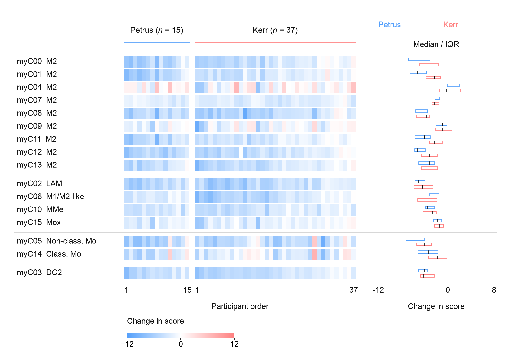

<div align="center">

# EasyViz

**Scientific panels, ready for your manuscript.**

Source data · Create & reproduce · Consistent typography · Individual exports

[Examples](#examples) · [Use](#use) · [Setup](#setup) · [QA](evals/release-qa/README.md)

</div>

EasyViz helps an Agent turn prepared source data into clear scientific figures. Choose a chart or supply a reference, select a palette and export format, and get a reproducible panel at its final manuscript size.

| Track | Input | Approach |
| --- | --- | --- |
| **Create** | Source data and a chart type or scientific question | Choose useful encodings, grouping and summaries; compare alternatives when the design matters. |
| **Reproduce** | A reference image and source data | Read the visual structure, adapt it to your data, and check the result. Author code is optional. |

Palettes, proportions, dimensions and fonts are configurable. Each panel is exported separately for assembly at its recorded size. General statistics are supported; upstream bioinformatics analysis stays outside the Skill. Explanatory prose belongs in the accompanying caption.

## Examples

**Create · paired myeloid changes**

52 participants, 16 subtypes. Consistent columns retain each participant's identity across rows; aligned summaries compare the two cohorts.

<p align="center"><a href="examples/create/paired-myeloid-remodeling/"></a></p>

**Reproduce · cohort BMI distributions**

Eight cohorts reconstructed from source data and a reference image, with a revised presentation. Density choices and adaptations are documented.

<p align="center"><a href="examples/no-author-code/massier-bmi-violin/"></a></p>

[Browse all examples](examples/README.md) · [Palette choices](skills/easyviz/references/palettes.md) · [Design decisions](skills/easyviz/references/design-decisions.md)

## Use

```text
Use $easyviz to plot my source data as a dot plot.
Use blue / amber / teal / pink, Arial 8 pt, and a 180 × 120 mm panel.
Export PDF, SVG and PNG, with the caption in a separate file.
```

For reproduction, attach a reference image and state any requested changes. Deliverables include the individual panel, caption, runnable script, settings, plotting data and relevant checks.

The `$easyviz` shorthand requires a discoverable skill. For an uninstalled checkout, ask the Agent to read and use the absolute path to `skills/easyviz/SKILL.md`.

## Setup

Download the plugin ZIP from [Releases](https://github.com/idealstarry/EasyViz/releases), or build it locally with Python 3.12:

```sh
python3 -m venv .venv
.venv/bin/python -m pip install -r requirements-dev.txt
.venv/bin/python scripts/build_plugin.py
```

The portable package is written to `dist/easyviz/`; building it does not register it in Codex. See the [package guide](plugins/easyviz/README.md) for runtime requirements and resource entry points.

## Inside

- [EasyViz](skills/easyviz/SKILL.md) — the two tracks, data choices and panel delivery.
- [Reference Reader](skills/easyviz-reference-reader/SKILL.md) — independent interpretation of a supplied image.
- [Figure Reviewer](skills/easyviz-figure-reviewer/SKILL.md) — actual-image review against the adopted requirements.

[Development](docs/development.md) · [Release QA](evals/release-qa/README.md) · [Generalization limits](docs/generalization.md)

## License

Original code and documentation: [MIT](LICENSE). Third-party data and reference figures retain their own terms; see [source attribution](THIRD_PARTY_NOTICES.md).
