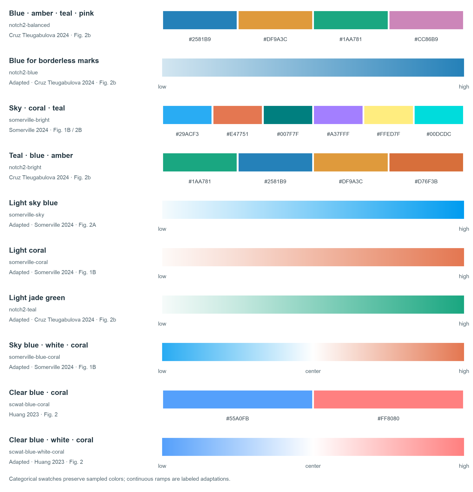

<div align="center">


# EasyViz

**Scientific panels, ready for your manuscript.**

</div>

EasyViz helps an Agent turn prepared source data into clear scientific figures. Choose a chart or supply a reference, select a palette and export format, and get a reproducible panel at its final manuscript size.

| Track | Input | Approach |
| --- | --- | --- |
| **Create** | Source data and a chart type or scientific question | Choose useful encodings, grouping and summaries; compare alternatives when the design matters. |
| **Reproduce** | A reference image and source data | Read the visual structure, adapt it to your data, and check the result. Author code is optional. |

Palettes, proportions, dimensions and fonts are configurable. Each panel is exported separately for assembly at its recorded size. General statistics are supported; upstream bioinformatics analysis stays outside the Skill. Explanatory prose belongs in the accompanying caption.

Related panels can share a [figure profile](skills/easyviz/references/figure-profile.md) so category colors, typography and quantitative scales stay consistent. Dot plots distinguish [measured zero, unmeasured and absent data](skills/easyviz/references/dot-states.md) without changing proportional dot areas. Unknown configuration fields fail with a correction hint.

For a first panel, the Agent can [generate a validated specification](skills/easyviz/references/quick-start.md) from explicit column meanings and use measured layout to fit labels and legends inside the requested canvas. Dense heatmap value labels are checked against their cells. These helpers reduce repeated configuration work; actual image review still determines readability and balance.

Choose a view for the question the reader needs to answer:

| Reading task | Available views |
| --- | --- |
| Compare values or compositions across categories | Heatmap, dot plot, stacked composition, annotated matrix with aligned margins |
| Compare raw distributions | Box/violin with points, median/IQR swarms, empirical cumulative distributions (ECDF) |
| Follow measurements from the same unit | Paired or repeated-condition points with optional connectors, participant correspondence matrix |
| Compare components and replicate variation | Stacked or grouped component bars with raw observations and explicitly defined SD; separate supplied-ratio summaries |
| Compare supplied coordinates or estimated effects | Scatter with optional proportional circle area; linear/log forest plots with supplied asymmetric intervals |

The [chart library](skills/easyviz/references/chart-library.md) links the input
contracts and reusable scripts. Specialized views preserve their scientific
definitions rather than treating every table as interchangeable.

## Examples

**Create · paired myeloid changes**

Three designs for the same 832 paired changes: individual values, cohort distributions, and participant correspondence.

<p align="center"><a href="examples/create/paired-myeloid-remodeling/"></a></p>

**Create · annotated inhibition matrix**

Genome-status annotations and full-matrix summaries accompany a selected 20 × 20 view.

<p align="center"><a href="examples/create/annotated-inhibition/"></a></p>

**Create · cell atlas composition**

Counts, within-depot proportions, and aligned totals for 16 myeloid subtypes across three depots.

<p align="center"><a href="examples/create/cell-atlas-dotplot/"></a></p>

**Create · cohort effects**

Supplied estimates and asymmetric confidence intervals; synthetic data demonstrate custom geometry and field mapping.

<p align="center"><a href="examples/create/paired-effects/"></a></p>

**Reproduce · integration comparison**

Five methods across five cell classes, reconstructed from a reference image and source data without author code. All 25 rates, including three zeros, are retained.

<p align="center"><a href="examples/no-author-code/massier-integration-radar/"></a></p>

**Reproduce · Nature Communications Source Data**

Two additional papers become reusable implementations: supplied coordinates with proportional circle area, and supplied estimates with asymmetric intervals on a log axis. All source rows are retained; zero sizes, source filtering and unknown sample sizes are recorded explicitly.

<p align="center"><a href="examples/no-author-code/xiang-bubble-volcano/"></a> <a href="examples/no-author-code/vabistsevits-forest/"></a></p>

[Literature Source Data workflow and candidate queue](skills/easyviz/references/literature-source-data.md) · [Generic supplied-interval script](skills/easyviz/references/interval-plot.md)

**Observations and components · two more Source Data papers**

Urschel's 127 complete before/after pairs support a log-scale median/IQR swarm,
an optional connected view, and a new ECDF of all 254 observations. Truong's
Nature Methods data supply 7 conditions × 3 replicates: component stacks,
grouped component comparisons, and a separate supplied-ratio panel. Raw
observations and true zeros are retained; each summary states what it measures.

<p align="center"><a href="examples/no-author-code/urschel-paired/"></a> <a href="examples/create/urschel-ecdf/"></a></p>

<p align="center"><a href="examples/no-author-code/truong-components/"></a></p>

These are auditable, configurable implementations. The swarm follows the
published structure with recorded differences; the ECDF and separate component
views are explicitly new designs. They demonstrate specific aesthetic and data
choices, rather than establishing a universal journal style.

[Browse all examples](examples/README.md) · [Design decisions](skills/easyviz/references/design-decisions.md)

**Palette choices**

<p align="center"><a href="skills/easyviz/references/palettes.md"></a></p>

## Use

For a local Agent that can run Python and inspect images, a plain request is enough:

```text
用 EasyViz 画这份数据。做点图：横轴是 condition，纵轴是 gene，
点面积表示 fraction，颜色表示 mean_score。尺寸 120 × 90 mm，字号 8 pt。
请保留所有数据，检查实际成图，导出 PDF、SVG 和 PNG，图注单独保存。
```

The Agent follows the [first-panel workflow](skills/easyviz/references/quick-start.md); the user need not write plotting code or JSON. Specify the scientific meaning of ambiguous columns, proportions and independent samples when needed. The Python resources are portable to local coding Agents; installation and skill discovery depend on the client.

```text
Use $easyviz to plot my source data as a dot plot.
Use blue / amber / teal / pink, Arial 8 pt, and a 180 × 120 mm panel.
Export PDF, SVG and PNG, with the caption in a separate file.
```

For reproduction, attach a reference image and state any requested changes. Deliverables include the individual panel, caption, runnable script, settings, plotting data and relevant checks.

The `$easyviz` shorthand requires a discoverable skill. For an uninstalled checkout, ask the Agent to read and use the absolute path to `skills/easyviz/SKILL.md`.

## Setup

Give your local Agent this request:

```text
Install or update https://github.com/idealstarry/EasyViz in my local
ChatGPT Desktop. Read its INSTALL.md and complete the installation for me.
```

The Agent follows [INSTALL.md](INSTALL.md) to download, install or update, and verify EasyViz. It handles the local requirements and preserves your other plugins. Start a new chat for first use; a running desktop may need to refresh or restart before showing an update.

[Release ZIPs](https://github.com/idealstarry/EasyViz/releases) are available for portable use. Building or downloading a package alone does not install it. See the [package guide](plugins/easyviz/README.md) for runtime requirements and [development guide](docs/development.md) for local builds and release checks.

## Inside

- [EasyViz](skills/easyviz/SKILL.md) — the two tracks, data choices and panel delivery.
- [Reference Reader](skills/easyviz-reference-reader/SKILL.md) — independent interpretation of a supplied image.
- [Figure Reviewer](skills/easyviz-figure-reviewer/SKILL.md) — actual-image review against the adopted requirements.

[Development](docs/development.md) · [Release QA](evals/release-qa/README.md) · [Generalization limits](docs/generalization.md)

Actual-image reviews, changed-data checks and Agent trials are documented in
[generalization evidence](docs/generalization.md). Earlier comparisons and
negative results remain in their original records; successful exports alone do
not establish visual quality or a gain across models.

## License

Original code and documentation: [MIT](LICENSE). Third-party data and reference figures retain their own terms; see [source attribution](THIRD_PARTY_NOTICES.md).
