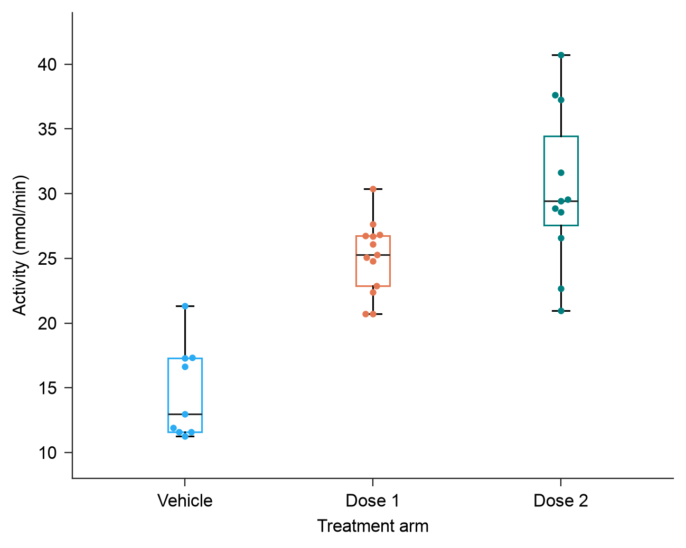

# Fresh basic Create workflow

The actual public EasyViz draft-to-render workflow produced a single clear distribution panel at **110 × 88 mm**, with embedded **Arial 8 pt** in the PDF. The first actual render is preserved; no visual repair or second render was needed. This is a local usability trial on a synthetic engineering fixture. It makes no claim about biological findings, aesthetic superiority, external models, or a with/without-skill effect.



The panel compares Vehicle, Dose 1 and Dose 2 using outline boxplots and all **33 independent biological specimens**. Each displayed value is the mean of two technical reads. The independent key is **arm + biospecimen_key**, because the Dose arms reuse specimen labels and the notes explicitly define unpaired groups. Vehicle has 9 specimens, Dose 1 has 13 and Dose 2 has 11. No source row or independent specimen was excluded; no inferential test was run.

## Deliverables

- [PNG](attempt-01/panel.png), [PDF](attempt-01/panel.pdf), [editable-text SVG](attempt-01/panel.svg)
- [Separate caption](caption.md)
- [Adopted design](adopted-specification.md), [actual renderer spec](attempt-01-spec.json), [resolved settings](attempt-01/settings.json)
- [Original source archive](data/source/assays.csv), [study notes](data/source/study-notes.md), [prepared specimen means](data/specimen-means.csv), [source/summary audit](data/data-audit.json), [saved plotted rows](attempt-01/plotting-data.csv)
- [Runnable preparation + public plotting wrapper](make_panel.py), [actual-output verification](verify_panel.py)
- [Compact docs/tools trace](trace/workflow-trace.json), [public renderer command](trace/attempt-01-render-command.json), [first-render freeze hashes](attempt-01-freeze.json)
- [Actual numerical/export checks](qa/attempt-01/actual-checks.json), [first issues](qa/issues-initial.json), [final issues](qa/issues-final.json), [independent first-pass review](qa/review-pass-01.md)

## Reproduce

Use the existing scientific environment; no installation or build is needed. A fresh attempt name is mandatory so the frozen first render cannot be overwritten.

```sh
/Users/starry/Desktop/EasyViz/.venv/bin/python /Users/starry/Desktop/EasyViz/evals/basic-forward-v0.4.3/make_panel.py --attempt attempt-rerun
/Users/starry/Desktop/EasyViz/.venv/bin/python /Users/starry/Desktop/EasyViz/evals/basic-forward-v0.4.3/verify_panel.py --attempt attempt-rerun
```

The wrapper invokes the public `draft_spec.py` and `render.py` entry points with explicit group, value and unit fields. It records the commands and freezes all actual export hashes before image review. The adopted bright palette is Vehicle `#29ACF3`, Dose 1 `#E47751`, Dose 2 `#007F7F`; these are the first three catalog `somerville-bright` colors, explicitly assigned to the current arm labels.

## Evidence and usability findings

The source audit independently confirmed all 66 technical rows become exactly 33 arm-specific specimen means. Saved SVG geometry was separately checked against independently recomputed quartiles, median and whisker caps. The actual PDF and SVG preserve the whole 110 × 88 mm page; PNG is 1299 × 1039 px with approximately 300 dpi metadata. Actual PDF text spans are ArialMT at 8 pt and the font is embedded. Source/export hashes still match the first-render freeze. Automated output QA reports no clipping, tick collision, missing glyph, or point-to-point packing failure.

The actual full PNG and whole-canvas PNG/PDF 96 dpi review representations were opened. Palette identity, thin strokes, category spacing and required text were inspected. A calibrated physical print view is unavailable; actual page/font measurements accompany nominal-size image inspection. A successful renderer result alone was not treated as visual evidence.

Two workflow frictions were retained in the trace. System Python and the app-located bundled Python lacked Matplotlib, including for help/schema; the existing project environment resolved this without installation. At read time, `create.md` preview advice was broader than SKILL Execute's unresolved-reading-task condition. The known comparison task and explicit technical-repeat preparation justified a direct box + all points panel. The parent later reported a documentation wording repair, separate from this frozen trial result.
