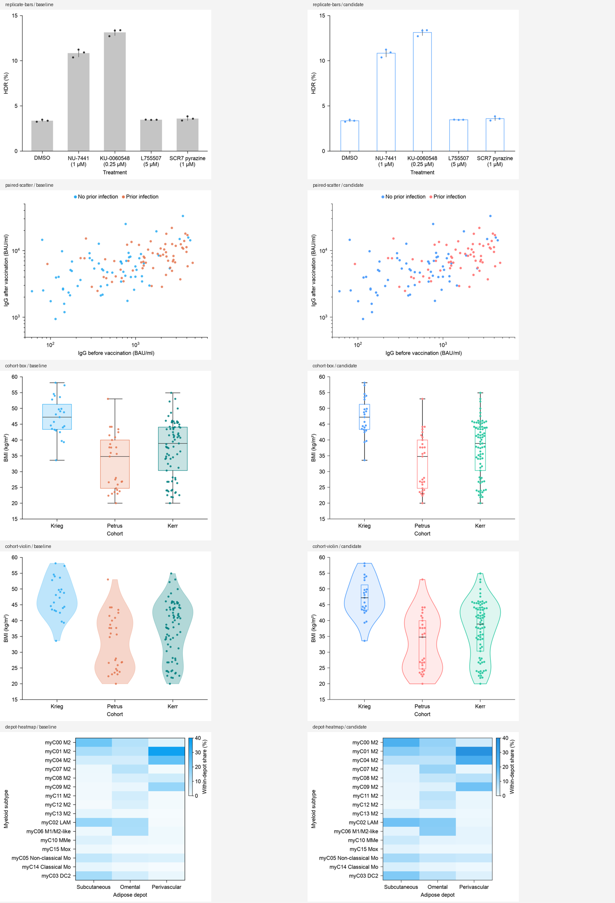

# Basic-panel design evidence for v0.4.3

This record is the original release snapshot at tag `v0.4.3`
(`5acbb5b36166b99097f2a0fffad321a4abf7c315`). Current main has a separate
[same-version refinement record](../create-refinement-v0.4.3/README.md), with
actual published-candidate comparisons and new checks. The original review
preference below is not an assessment of the subsequently refined images.

This is bounded implementation and design evidence on known Source Data,
not a new-Agent comparison or evidence of CNS acceptance. Five ordinary plot
types were rendered on the same source and scales before/after explicit design
choices. Each has one real-source transfer that changes field mapping, category
count or value domain.

The comparison sheet is a review aid; each cell embeds the actual standalone
panel. Place a manuscript export at its recorded 110 × 88 mm size rather than
using this contact sheet. Final PNG/PDF/SVG, 96 dpi PDF previews, explicit specs,
captions and source provenance are in
[`examples/create/basic-panels` at the release tag](https://github.com/idealstarry/EasyViz/tree/v0.4.3/examples/create/basic-panels).

`validation.json` records 15 baseline/candidate/transfer runs, independent mean
and sample SD/quartile checks, exact raw numeric artist coordinates and matrix
ordering through a rebuilt public-renderer figure, and separate checks of the
actual saved export dimensions, font embedding and resolution. The renderer
QA and advisory readability records are preserved alongside the exports.

`standalone-validation.json` checks the five final panels after an explicit
DejaVu Sans font adoption and writing to an external directory. It exercises
the same public APIs and prepared CSVs; it does not require the development
workbooks or author code.

The violin candidate adds a raw-scale Q1/median/Q3 layer, so its comparison is
not solely cosmetic. No source value, KDE method, numeric scale, font size or
canvas dimension was changed between the matched baseline and candidate.
Independent image review remains separate from these technical checks.

The [independent visual review](independent-review.md) and its
[structured record](independent-review.json) cover all 30 individual PNG/PDF
preview files. Candidate preference was recorded for bars, boxes, violins and
the heatmap; the scatter was a tie. The review requested variant-specific
transfer captions, which have since been added without changing any image.
`reviewed-image-hashes.json` records the unchanged 30-file inventory and checks
all 15 panel PNGs against the pre-review numerical/export evidence.
