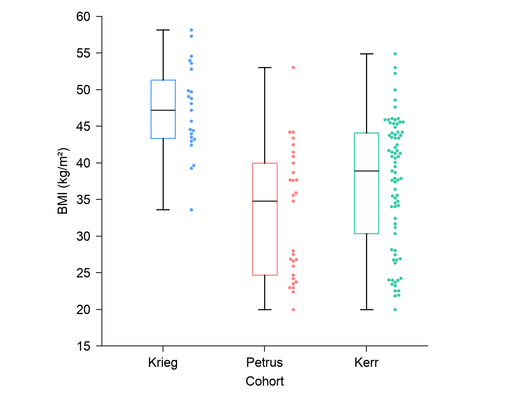

# Create color-role refinement within 0.4.3

The task is to learn useful color and layer decisions from literature for new
scientific panels. Create does not require a user-supplied reference image:
it selects an eligible mechanism for the current data and reading task.
Reproduce continues to follow its adopted reference and declared adaptations.
This refinement revises four basic Create families and their source-transfer
probes after feedback on the published gallery's habitual blue/green/coral use.

## Literature observations and design adaptations

The supplied PROGENy, scWAT and Vanneste PDFs were rendered and inspected.
[Source observations](literature-observations.json) retain the exact PDF hashes,
page/figure anchors and 25 selected vector records with original RGB floats,
path roles and geometry. Complete articles and figure-page screenshots are not
bundled here. Observed paints are not recovered author-code constants or a
universal Nature palette.

| Reading task | Observed mechanism | Decision in these new panels |
| --- | --- | --- |
| One quantity, categories already identified by x labels | PROGENy Fig. 2d uses gray bars; scWAT Fig. 3j uses deep-gray control observations and an open control bar. | Graphite open means, raw repeats and sample SD in the single-outcome bar case. Filling the tall bars was also rendered and inspected. |
| Two classes mixed in one scatter field | scWAT Fig. 2g uses distinguishable blue/pink curve and point paints. | The observed fitted-line strokes `#3795D3` / `#FF5FBD` are explicitly reassigned to the two raw-point groups; no fit or source biological label is added. |
| Categories identified by separate distribution lanes | PROGENy Fig. 4c separates neutral contours from colored inner summaries and density/pathway areas. | Violet, mint and salmon IQR areas with graphite boundaries and neighboring raw points; the additional cohort uses gray. White violin bodies retain the same KDE. Applying all selected source-area colors to cohort IQRs is an adaptation. |
| Quantitative matrix | Literature figures use different scales and cell proportions for different quantities. | Keep the existing justified linear blue 0–40% scale, cells and annotations. This color pass makes no heatmap improvement claim. |

The new `progeny-summary` and `scwat-blue-pink` presets record role eligibility
and source precision. Pale area fills are kept opaque in these bounded
summaries; they are not automatically eligible for tiny point or thin-line
marks. Neutral data marks are a valid choice when labels already decode the
categories. Related cohort box and violin views retain one category mapping.

## Actual comparisons

[Before manifest](before/manifest.json) freezes the actual published main
candidates from commit `900dc34dc14f580016c686f696021318a1b6c839`, including
PNG and adopted specification hashes. These are the predecessors used for this
color comparison. The validator's historical omitted-option `baseline` is a
separate comparison: in particular, the published predecessor violin already
had inner quartiles. This pass adds no statistic to that published design.

Four [whole-panel side candidates](candidates/manifest.json) retain their
specifications, actual exports, plotting data and hashes:

- [Neutral open bars](candidates/neutral-open/output/panel.png) and
  [neutral filled bars](candidates/neutral-filled/output/panel.png). Open bars
  were preferred here: the tall filled areas add mass without improving the
  three observations and SD reading.
- [Blue/pink scatter](candidates/scatter-blue-pink/output/panel.png) and
  [blue/terra scatter](candidates/scatter-blue-terra/output/panel.png). Both
  decode the actual cloud; the selected blue/pink pair is a scoped visual
  preference, not a universal winner.

| Actual published predecessor | Current cohort box |
| --- | --- |
|  |  |

The [independent image review](color-review.md) covers all five before PNGs,
all five current panels and five transfer panels, ten nominal 96 dpi PDF
previews, the four side candidates and the relevant literature pages. It records
actual viewed paths, hashes, judgments, resolved wording findings and residual
limitations separately from numerical/export checks.

## Scoped checks

- [439 tests passed](unit-tests.log), including ten new renderer tests for raw
  coordinates, KDE/quartiles, color bindings, defaults and invalid settings.
  The initial [sandbox run](unit-tests-sandbox.log) could not bind the temporary
  localhost server in 26 workbench tests; the full run above passed with the
  needed local-server permission.
- [15 basic-panel runs](validation.json) passed independent numerical and
  export checks: historical omitted-option baseline, current candidate and
  source-transfer probe for each family. Current candidate/transfer PDF/SVG/PNG
  hashes were independently checked against this report. All current panels
  retain 110 × 88 mm, 8 pt Arial, embedded-font PDF, editable-text SVG and 300 dpi
  PNG. Log-axis superscripts use Matplotlib's smaller math glyphs.
- [Eight legacy pixel checks](legacy-distribution-pixels.json) compare actual
  before-change and current runtimes on color-option-omitted saved specs.
  Pixel equality is bounded backward compatibility.
- [Extracted-package checks](package-check.log) passed for the final build.
  A separate [fresh-ZIP replay](package-replay.json) reproduced 19 basic and
  repair-outcome main/transfer export sets byte-identically in the same
  environment with Arial. It checks PNG/PDF/SVG and applicable plotting CSVs.
- [Local installation](local-install.json) is enabled; an
  [independent content check](installed-content.json) verifies every one of
  the 726 package files in both the local source and cache against the final
  archive. [Build identity](build.json) records archive and content hashes.

The public renderer adds explicit distribution `point_color`,
`box_fill_alpha` and `violin_inner_fill_alpha` settings. Omission preserves the
previous settings. Summary face, boundary and raw-point bindings describe the
actual SVG layers independently. These are available for Agent specification
or code edits; this pass does not add automatic workbench handling for every
new fill setting.

No source row, measurement coordinate, statistical meaning, numeric scale,
marker size, packing position, KDE definition or agreed canvas/font changed in
this color pass. The earlier narrow repair-outcome panels and grouped gap
checks are retained. Documentation and the main README now explain task-based
choices and feature different reading tasks without repeating every variant
as a primary gallery item.

## Limits and version identity

This is a main-branch continuation of 0.4.3. The original published tag and
release ZIP remain historical snapshots; the new checked local package is built
from this continuation. It establishes neither causal Agent/model improvement
nor publication acceptance. The two-point-diameter distribution observations
remain tiny at nominal 96 dpi; graphite improves contrast without proving
every point countable. Existing flat trimmed KDE closures and the adopted
broad canvas remain review notes. Color-vision accessibility and physical print
quality were not measured.
