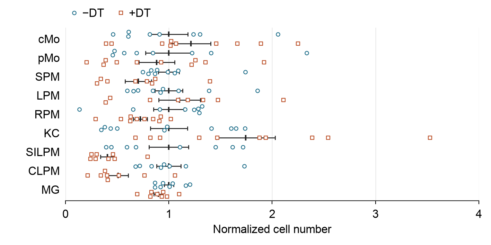

# Fresh local Create exercise

The [same predefined task](../fresh-task.md) was given to two fresh agents using
the same model family. Both received 156 real, already normalized Source Data
observations, the scientific question, explicit mean ± SEM, 120 × 60 mm and
Arial 8 pt. Neither received the original paper figure, previous examples or
human aesthetic feedback before its first finished output.

| Ordinary Python workflow | Current EasyViz workflow |
| --- | --- |
|  |  |

These are the agents' first **finished** deliveries after internal image review,
not their uncorrected first renders. The ordinary workflow used three actual
visual passes; EasyViz used two. Different designs and implementation choices
were allowed. This unblinded one-input exercise cannot quantify model-wide or
causal Skill effectiveness. Pass counts are records of these runs, not an
efficiency estimate. Neither result certifies publication quality.

The EasyViz agent selected a custom two-condition raw lane with adjacent mean
and SEM strokes. It preserved SEM rather than substituting the focused bar
recipe's sample SD or inventing the unit IDs that recipe requires. The ordinary
workflow chose a horizontal view with condition-specific shapes. Their reading
tradeoffs are assessed independently after both outputs were frozen.

The [independent review](independent-review.md) verifies all source values,
statistics and actual vector marks. Separating raw and summary lanes removes
summary occlusion in this output. The ordinary workflow provides 2.66 times
the physical value-axis resolution and also distinguishes conditions by shape.
These are specific reading tradeoffs on this task, not an overall ranking.

## Files and rerun

- [Source semantics and exact values](../source-intake/input-contract.json),
  [CSV](../source-intake/observations.csv) and
  [extraction](../source-intake/extract_figure2h.py).
- Ordinary workflow: [code](baseline/plot.py), [caption](baseline/caption.md),
  [validation](baseline/attempt-05/validation.json), [read/attempt record](baseline/read-and-attempt-record.md)
  and [final freeze](baseline/final-manifest.json).
- EasyViz workflow: [code](with-skill/attempt-02/plot.py),
  [caption](with-skill/attempt-02/caption.md), [QA](with-skill/attempt-02/qa.json),
  [access record](with-skill/actual-access.json), [design rationale](with-skill/design-rationale.md)
  and [first-finished freeze](with-skill/first-finished-delivery-freeze.json).

From the repository root, use its selected plotting environment:

```sh
python evals/create-purpose-overhaul-v0.4.4/fresh-run/with-skill/attempt-02/plot.py \
  --data evals/create-purpose-overhaul-v0.4.4/source-intake/observations.csv \
  --contract evals/create-purpose-overhaul-v0.4.4/source-intake/input-contract.json \
  --out /tmp/easyviz-new-cell-number-attempt
```

Use a fresh destination; the trial script refuses to overwrite exports.
Its default source path records the original local run, so other checkouts must
use the explicit paths above. This is a tested case implementation, not a
general chart interface. Initial and corrected trial images remain immutable.

After the trials were frozen, the export review's nearest-integer-only raster
check was corrected. The original helper is retained in the
[raster snapshot](../raster-review/create_review-before.py); the
[forward diagnostic](../raster-review/owner-forward-diagnostic/diagnostic-summary.json)
shows that ordinary floor-sized PNGs pass without rewriting the trial. The
EasyViz trial's one-pixel white padding remains part of its recorded artifact,
not a requirement for future plots.

Source: Vanneste et al., *MafB-restricted local monocyte proliferation precedes
lung interstitial macrophage differentiation*, Nature Immunology (2023),
[DOI 10.1038/s41590-023-01468-3](https://doi.org/10.1038/s41590-023-01468-3),
[CC BY 4.0](https://creativecommons.org/licenses/by/4.0/). The figure is a new
descriptive design from sheet 2h, not a reproduction of the paper image.
Normalization is retained; absent mouse/batch IDs prevent inferred pairing and
reconstruction of the original inference model. No tests or significance are
added. [Full intake](../source-intake/vanneste-figure2-intake.json).
