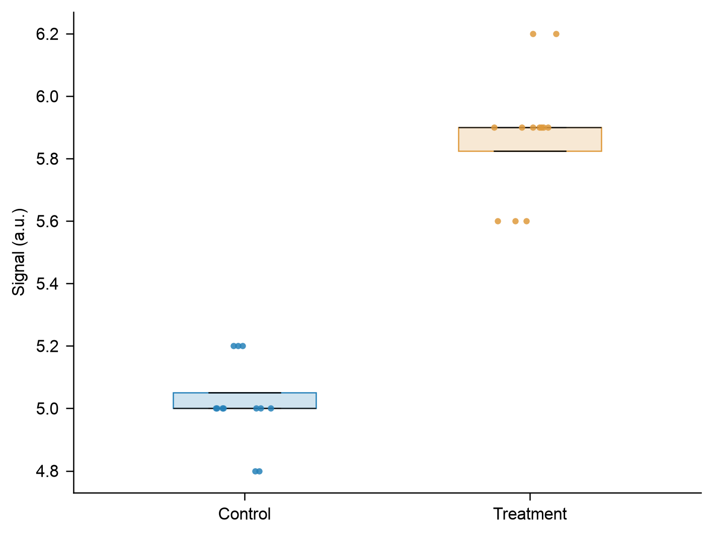
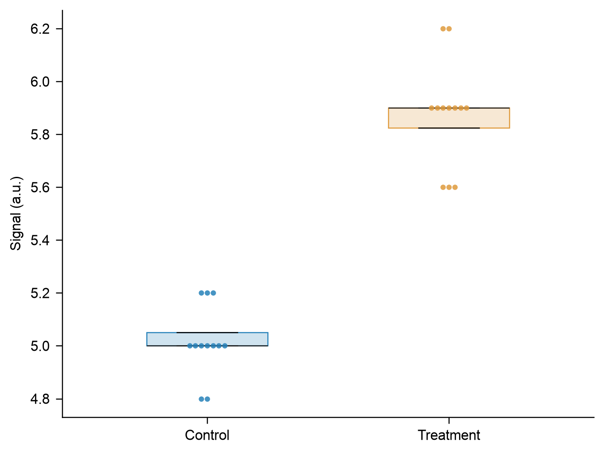

# Physical distribution-point placement — 0.4.1

This synthetic engineering comparison uses the same 24 observations, seed 23,
Arial 8 pt text, 120 × 90 mm canvas, colors and 3 pt circles. Both panels use the
recorded v0.4.1 renderer: legacy random jitter versus opt-in physical beeswarm.
The parent and implementation agent actually viewed both PNGs. It is not a
model comparison, an independent aesthetic preference test or publication proof.




The independently applied circle-spacing report in `comparison.json` counts
12 intersecting circle pairs under jitter and zero under beeswarm; requested
spacing is 3.3 pt. This geometric status is separate from legacy renderer QA,
which explicitly leaves jitter circle spacing unchecked. Every original source
row remains, and the measurement coordinate, canvas, font and mark size stay
fixed. Point-summary intersections and text/design quality still need review.

`data.csv`, both JSON specs, plotting tables, actual settings, semantic maps and
all three exports are retained. The renderer hash identifies the historical
run. New runs need their own hashes and output directories. Run from the repo
root with its scientific Python environment:

```sh
.venv/bin/python skills/easyviz/scripts/render.py --data evals/crowding-layout/v0.4.1/data.csv --spec evals/crowding-layout/v0.4.1/beeswarm.json --out /path/to/new-attempt
```
