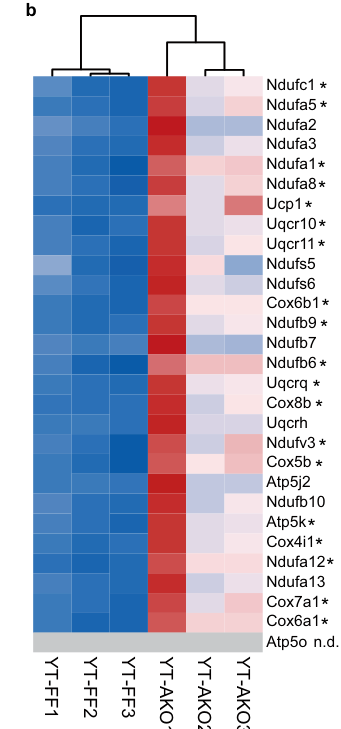
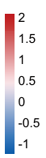
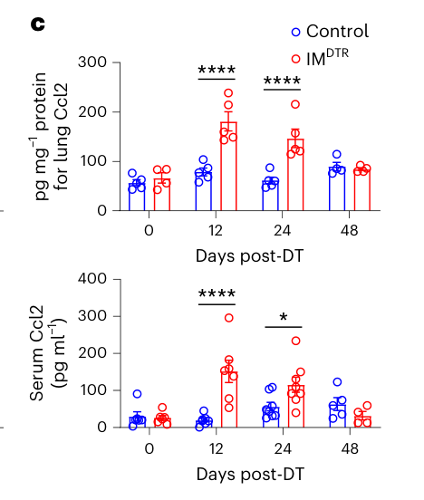
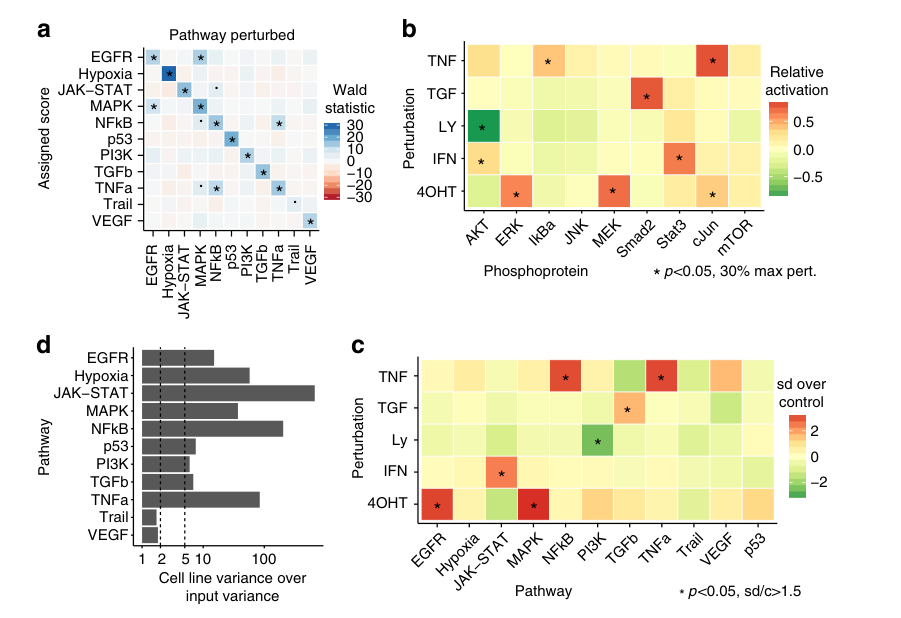

# Literature intake for complex Create panels

These cases start from numeric Source Data and a reading question. The publication crops supply design mechanisms for critique; their plotted values, statistical layers and full layout are not runtime reproduction targets. No existing EasyViz examples were edited during intake.

## Confirmed 0.4.5 inputs

| Case | Question and supplied records | Contract |
| --- | --- | --- |
| scWAT thermogenic expression | Compare genotype-associated expression and sample variation in 29 genes × six mice: 174 exact TPM cells, including six author-provided Atp5o zeros. | [Data](scwat-expression/observations.csv), [input contract](scwat-expression/input-contract.json) |
| Lung/serum Ccl2 response | Compare two genotypes across four actual hours in two biological compartments: 88 mouse observations, 16 mean/SEM groups, eight author-adjusted P values. Lung and serum have different units. | [Data](vanneste-ccl2/observations.csv), [input contract](vanneste-ccl2/input-contract.json), [source P values](vanneste-ccl2/author-adjusted-p.csv) |

[Re-runnable extraction](extract_cases.py) preserves the **numeric strings stored in XLSX XML** with cell coordinates. The [independent extraction check](extraction-validation.json) compares every value with a separate OpenPyXL read: zero numeric discrepancies, no duplicate source-cell identities, all 16 Ccl2 means and SEMs checked. It validates data extraction, not figure aesthetics or scientific inference.

```sh
.venv/bin/python evals/development-v0.4.5/literature-intake/extract_cases.py
```

## Observable literature mechanisms

### scWAT Fig. 2b





1. **Row density comes from physical pitch.** The 29 gene rows have a regular pitch of about 6.625 pt in the published PDF; each of six column widths is about 12.753 pt. The cell width/height is about **1.93**, rather than forcing cells to be square. Gene labels occupy a dedicated column immediately beside the matrix. A new 8 pt panel requires its own larger physical row pitch; these author dimensions are observations, not defaults.
2. **Sample groups remain contiguous.** Three YT-FF samples sit beside three YT-AKO samples. The dendrogram adds statistical grouping in the original, but its linkage is not supplied. Create can use a genotype band and a modest group gap instead of inventing clustering.
3. **The matrix dominates the guides.** One narrow colorbar sits near the matrix top, so it does not compete with 29 data rows. Sample labels are rotated as a compact shared decoding layer rather than repeated in each cell.
4. **A detectability exception is visible.** Atp5o is a full grey row with an n.d. label; the source supplies six actual zeros. Zero must remain distinct from missing/unmeasured values. This row is retained in Create.
5. **Color is bound to the numerical transform.** The original scale ranges from −1 to 2 and is an author-generated standardized display. The Source Data sheet supplies TPM. An explicit Create transform such as log2(TPM + 1) needs its own absolute scale; the original colors and stars cannot establish transformed values or per-gene significance.

Original crop: Huang et al., [Nature Communications 14, 7102 (2023)](https://www.nature.com/articles/s41467-023-43021-8), Fig. 2b, **CC BY 4.0**. Cropped from the user-provided article PDF; no colors or marks were modified. Full source and clipping bounds are recorded in [provenance](provenance.json).

### Vanneste Fig. 3c



1. **Several layers have distinct jobs.** Slender open bars give the mean baseline-to-value relationship; hollow circles show actual mice; short whiskers give SEM. Circles and outlines are crisp and unfaded. Bars are not adjacent: a physical white gap separates the two genotypes.
2. **Primary marks exceed guide weight.** Relevant published PDF paths have approximately 0.482 pt bar/point/error outlines and 0.25 pt axes. This concrete hierarchy keeps the observations readable without heavy chart frames.
3. **The two compartments share only time.** Lung concentration and serum concentration use separate numeric axes and explicit different units. Shared x positions align the measured intervals, while independent axes prevent implying equal amounts.
4. **Annotation is outside the observations.** Comparisons sit above the applicable hour group with short local brackets. A compact genotype key decodes both compartments; the same hue maps to the same genotype throughout.
5. **Publication errors require correction.** The source sheet and caption specify **hours**, while both displayed x labels say “Days post-DT”. The Create contract adopts Hours post-DT. Learning style does not authorize copying a scientific label error.

Original crop: Vanneste et al., [Nature Immunology 24, 827–840 (2023)](https://www.nature.com/articles/s41590-023-01468-3), Fig. 3c, **CC BY 4.0**. Cropped from the user-provided article PDF; marks are unmodified. Methods describe euthanasia at each time before blood/lung collection, establishing terminal cross-sectional time groups. No mouse or experiment IDs connect supplied compartment values. The caption names ANOVA/Tukey, but does not define the correction family across compartments; preserve author P values without claiming that scope.

## Confirmed 0.4.6 transfer opportunity

[PROGENy coefficients](progeny-signatures/coefficients.csv) contain all **11,143** supplied gene/pathway coordinates: 1,013 genes, 11 pathways, 100 nonzero coefficients per pathway, 1,100 nonzero coefficients total. Exactly 87 genes belong to two signatures; 926 belong to one. These are model weights, not biological replicate measurements or computed pathway activity.

The [overlap table](progeny-signatures/derived-overlap.csv) records each contributing gene and separates shared count, Jaccard overlap and coefficient-sign agreement. Agreement is undefined when a pair shares zero genes. Structural coefficient zero is a real supplied value and is never treated as a missing coordinate. See the [contract](progeny-signatures/input-contract.json).



Observable mechanisms: a sparse matrix uses one row and one column decoding layer, small local marks add a second meaning, compact separate colorbars bind each scale, and magnitude/sign use different scientific scales across original subpanels. These mechanisms may transfer to a signature-overlap panel, but original Wald statistics and perturbation assays are different quantities and must not be relabeled as overlap.

Original crop: Schubert et al., [Nature Communications 9, 20 (2018)](https://www.nature.com/articles/s41467-017-02391-6), Fig. 2, **CC BY 4.0**; cropped with no mark changes. Signature coefficients are the article's Supplementary Data 1.

## Excluded scientific route

Vanneste Fig. 3b was considered for a six-population trajectory case. Its source sheet uses “− DT” / “+ DT” headers, while the article legend/caption uses “Control” / “IMDTR”. Neither source supplies a definitive alias key. [The conflict is retained](vanneste-figure3b-excluded.json); a six-population case is **excluded pending scientific group-identity resolution**. Numerical resemblance and column positions do not resolve condition identity or pairing.

## Scope limits

This intake establishes real source data, interpretation boundaries and publication design observations. A useful new output must still be rendered, reviewed at its actual size against a stated question, and improved using visible reading problems. These cases are not evidence of guaranteed CNS aesthetics or efficacy across agents/models.
