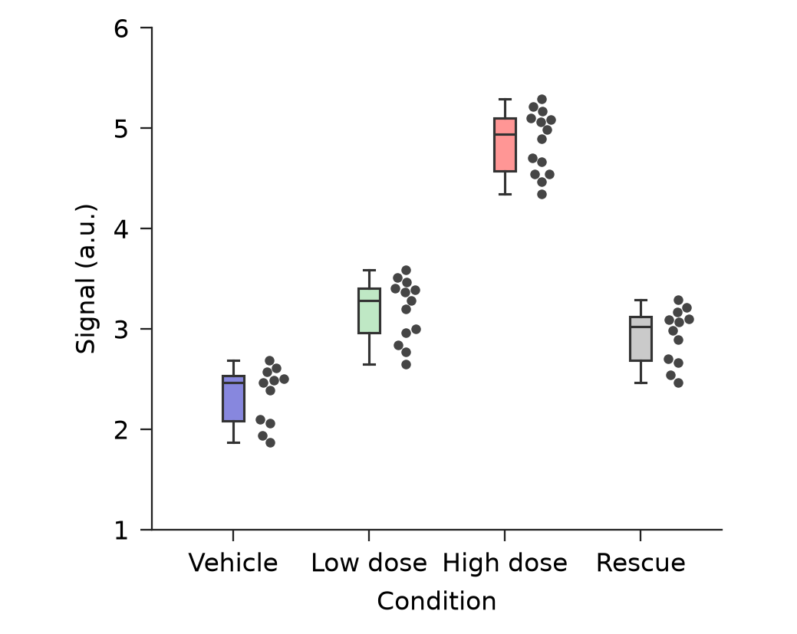
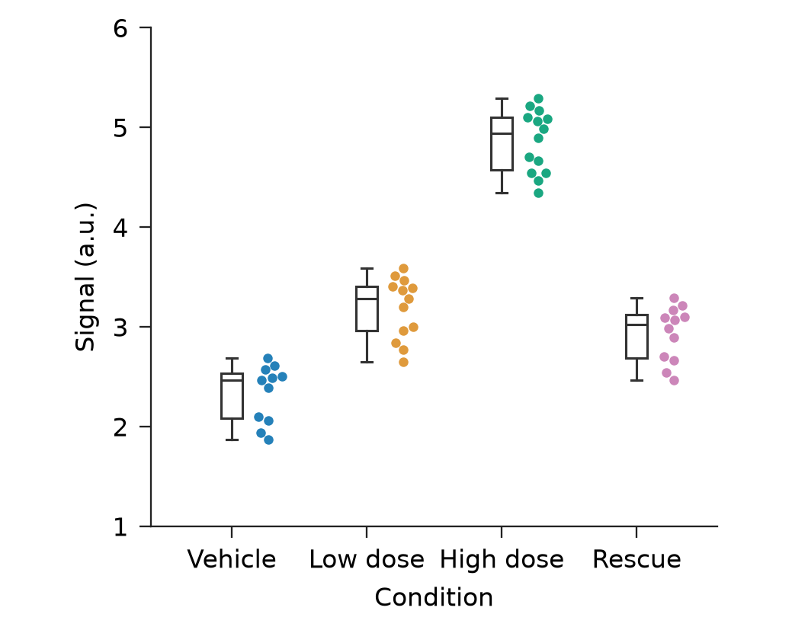

# Adopted Create intent: same-family transfer

This new synthetic prepared table exercises the executable purpose-to-role
contract. It is not published Source Data, a blind aesthetic comparison or
evidence of generalization. Both runs retain 50 specimen observations, literal
IDs, group order, box quartiles/whiskers, the 1–6 numeric range, 88 × 70 mm
canvas, 8 pt type and requested PNG/SVG/PDF formats.

| Adopted purpose | Actual rendered role treatment |
| --- | --- |
| Compare distributions, summary first | Category-colored bounded summaries and a graphite raw-observation lane |
| Inspect observations, observations first | Category-colored observations and neutral open summaries |

Both return `visual_review_pending`, because successful source/artist and
physical checks do not establish aesthetic readiness. The PNGs were actually
opened for self-review at full-canvas proportions. Boundaries, labels and
point/summary association were visible; calibrated nominal-size screen review
was not performed. `evidence.json` records the source freeze and limits, with
12 new intent tests and 30 legacy candidate regressions passing. Its hashes
identify development source versions, not end-user checksum deliverables.

Inputs and source-spec snapshots are preserved alongside both output folders.
The original run's absolute provenance paths remain in its records; those paths
are historical facts, not portable execution instructions. To replay, use the
copied `new-input.csv` and the chosen top-level `*-first.json` with
`create_candidates.py --new-draft --count 1`, writing a fresh output directory.

