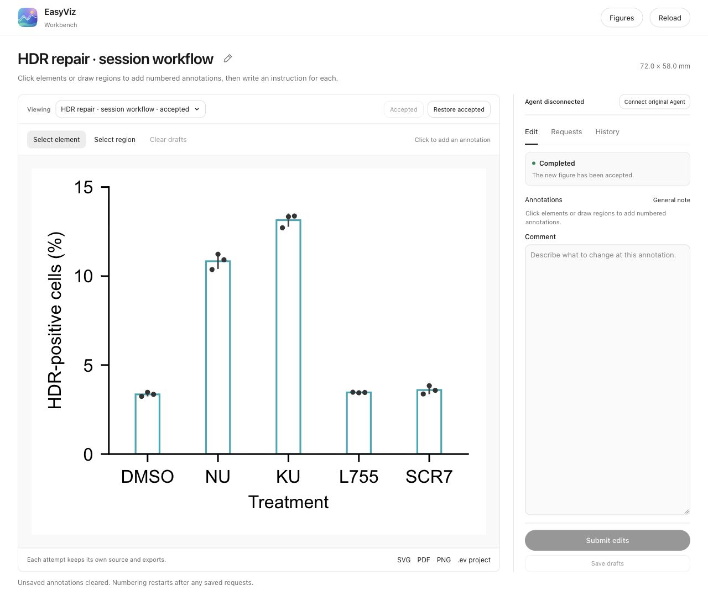

# EasyViz 0.5.1 release QA

Date: 2026-10-06. This record covers the release sources, portable package and
local workbench workflow.

## Final checks

| Check | Result |
| --- | --- |
| Complete test suite | 849 tests passed in 374.434 seconds |
| Declared dependency compatibility | Passed; 46 installed packages compatible |
| Portable ZIP | 952 files; 19,073,805 bytes |
| Full extracted-package validation | Passed, including real recipe/source-data redraws, vector exports, mappings, fonts and workflow discovery |
| Links in changed release documentation | 125 checked; all referenced files present in the published source set |
| Patch whitespace validation | Passed |

The release is published only after [Core checks](../../../.github/workflows/qa.yml)
passes on its GitHub commit. Temporary locks and local service directories are
excluded from the portable package. The ZIP is the release download; no separate
checksum file is required.

## Reviewed scope and repairs

The source review included renderer/export contracts, `.ev` validation and
transport, shared service state, source-bound requests, original-session
ownership, cancellation, manual completion, workbench interactions, installer
preservation and packaging. Independent reviewers used temporary projects and
actual renders to check defects and verify their repairs.

- Cancelled or closed MCP waits no longer claim later submissions.
- Completion retains the figure's adopted PDF, PNG or TIFF alongside SVG.
- Renaming updates the local `.ev`; fresh attempts retain custom figure names.
- Open-bar interiors are selectable and annotation badges avoid nearby points.
- Manual recording cannot bypass an active submitted batch; task publication
  rechecks its request state to prevent already-applied comments being queued.
- Portable packages omit temporary request locks and private local service
  directories while retaining scientific examples and runtime resources.

Checks also exercised partial completion, simultaneous completion, source
changes after submission, accepted-version restoration and portable pending
requests. The normal Save drafts → original-chat request loop is documented
in the [README](../../../README.md#local-workbench) and
[Agent edit guide](../../../skills/easyviz/references/apply-figure-requests.md#iterate-from-the-original-chat).

## Actual browser-to-Agent workflow

Computer Use selected mapped targets and regions, entered separate comments
and saved/submitted them using the workbench controls. Actual MCP waits
returned the submitted batches to the original authoring conversation. The
original Agent edited source/specification, rendered fresh outputs, inspected
the result and recorded completion. No separate editing model session was
started. The browser displayed the new attempt and accepted it.

| Observed state | Actual browser evidence |
| --- | --- |
| Selected target and comment | [Comments](comments.png) |
| Submitted, awaiting receipt | [Queued](queued.png) |
| Original Agent received the batch | [Received](received.png) |
| Source editing began | [Editing](editing.png) |
| Fresh exports were rendering | [Rendering](rendering.png) |
| Verified result awaited acceptance | [Ready to review](ready.png) |
| New attempt accepted | [Completed](completed-desktop.png) |

The reviewed panel uses 15 biological observations from the real
[repair-outcome Source Data case](../../../examples/create/repair-outcomes/README.md).
All observations, means, sample SD, source/statistical values, 72 × 58 mm size
and Arial 8 pt were retained. The final five outlines are `#20A7B4`; the
4.2 pt² raw-point area and Treatment label reflect earlier feedback.
The [actual SVG](panel.svg) and [PNG](panel.png) are included here. SVG, PDF,
PNG and `.ev` checks passed during the actual workflow. Very small SD intervals
remain small under the adopted scale; they were not enlarged artificially.

Native clicking also verified the repaired bar interior and observation 8 beside
its annotation badge; see the [selection check](badge-selection.png). At the
1280 × 900 desktop viewport, preview and inspector each measured 865.16 px high,
without inspector or horizontal overflow. Actual MCP rename updated the existing
`.ev` name, verified by reading its document metadata without a manual reexport.

## Limits

The demonstrated MCP delivery had the original Agent active in bounded waits.
After the Agent's turn ends, the normal loop resumes when the user asks that
same chat to apply saved comments. Host-scheduled idle continuation was not
verified and is optional. Starting an MCP server or registering an owner label
alone does not establish host delivery.

Browser file-picker upload and browser download are not claimed by this run.
Module/HTTP document import and extracted-runtime packing, reopening and
rerendering were checked separately. Private connection credentials, local
service registries and full development histories are excluded from this record.

Engineering checks do not certify aesthetics on untested datasets or quantify
model-wide improvement. Create and Reproduce still require scientific and
actual-image review for each delivered figure.
