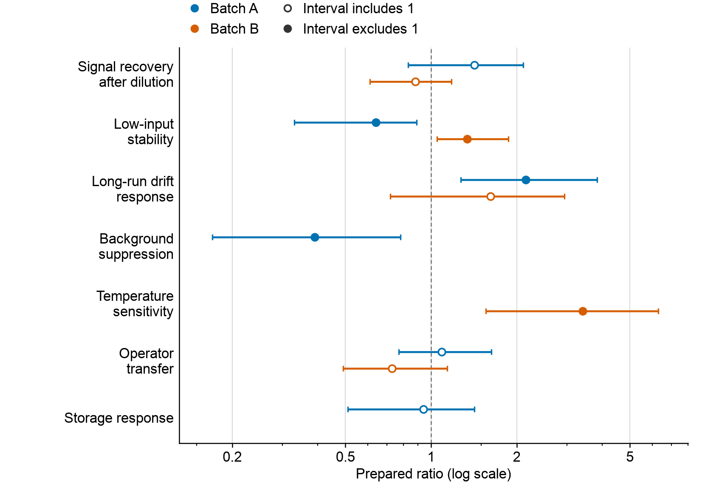
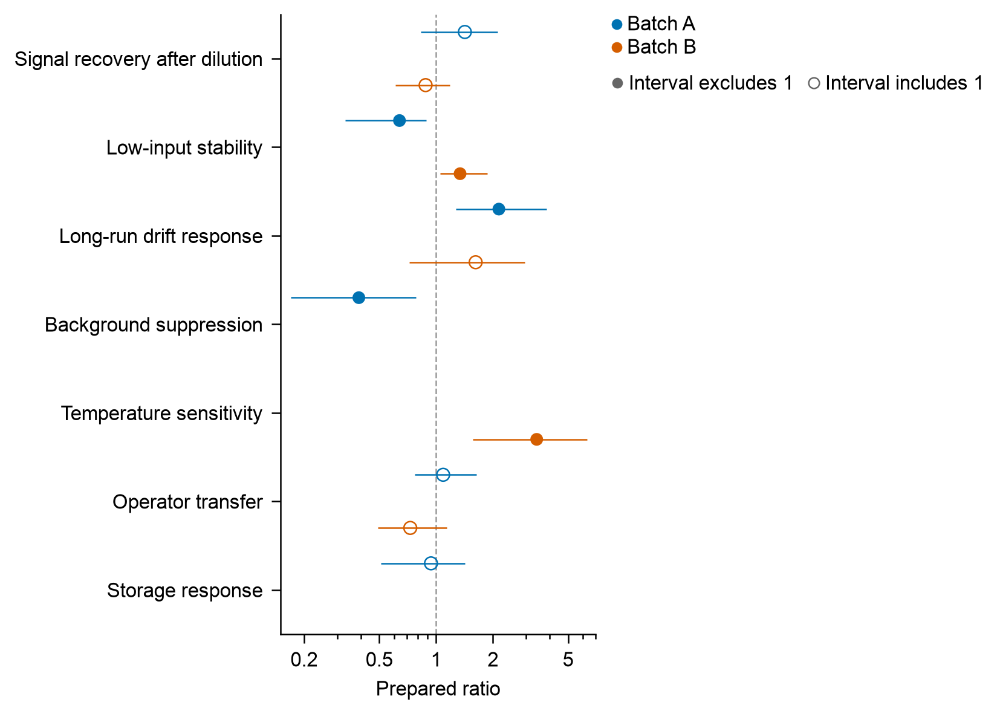

# WorkBuddy GLM unseen interval comparison

This evaluates whether the same external model produces a better figure on
unfamiliar inputs when given EasyViz. WorkBuddy 5.6.2 displayed GLM-5.3-Flash
for both independent new tasks. The backend identity was not independently
verified. Both arms received identical synthetic source bytes and the same
scientific/export request: eleven supplied asymmetric intervals, seven long
labels, two batches and three absent combinations, at 140 × 100 mm / Arial 8 pt.
No evaluator feedback or repairs changed the model outputs.

| Finding | Direct code | EasyViz |
| --- | --- | --- |
| Source values and sparse combinations | All 11 retained; 3 absent | Same |
| Log axis / reference / fill states | Correct; 6 hollow, 5 filled | Same |
| Actual PDF and SVG dimensions | 139.954 × 99.822 mm; small size drift | 140 × 100 mm |
| Actual fonts / SVG | Embedded Arial 8 pt; editable text | Same |
| Clean relocated rerun | Identical PNG pixels | Same |
| UI duration | 6m29s | Exact duration not obtained |
| UI consumption | 3.6 unspecified app units | 3.42 unspecified app units |
| Model-reported visual revisions | 2 | 0 |
| Anonymous visual comparison | **Preferred visually**, with minor legend grouping notes | Clear independent legend roles, but narrow data region and unused right space |

The [independent export audit](independent-numeric-audit.md) passed 36 checks
and failed two baseline dimension checks. Both data representations are
correct. The [visual reviewer](independent-visual-review.md) preferred B
(direct code) for its wider data span, clearer endpoints and relationship to
1, conditional on the separate export audit. The small baseline size drift
means this is not an unqualified winner on every requirement. EasyViz preserved
the canvas more accurately but **did not win visual readability** in this task.

## Evidence and subsequent improvement

Read the [pre-output protocol](protocol.md), [exact UI observations](launch-observations.json),
[provided snapshot hashes](protocol-inputs.json), and [frozen artifact hashes](freeze-manifest.json).
All 208 original artifacts remained unchanged during the independent audit.
Anonymous A = EasyViz and B = direct code; the mapping was withheld until the
visual review had been saved. The supplied vector files retained program
metadata. The reviewer inspected rendered PNG/PDF and captions, and reports
that SVG internals and PDF metadata were not inspected; available vector
metadata therefore remains a potential exposure limit. Future anonymous
reviews should remove identifying metadata or provide rendered views only.

The comparison revealed a general helper limitation: multiple automatic guides
were tried only as a right-side stack. Two interval keys used much of the canvas
width. The later [multiple-guide layout work](../multiple-guide-layout/README.md)
addresses that behavior separately, using local engineering comparisons.
Those later fixes are not part of this frozen model run and do not retroactively
change its result.

This is one synthetic task per arm with detailed matched instructions, shared
app memory, uncontrolled sampling/hidden prompts/backend routing and
instruction-based access boundaries. UI consumption is not a verified currency
or token count. It does not estimate general novice benefit or journal quality.
Its newer skill snapshot and different chart preclude a GLM-versus-Deepseek
comparison; the earlier [Deepseek dot pair](../workbuddy/README.md) has separate
evidence.
