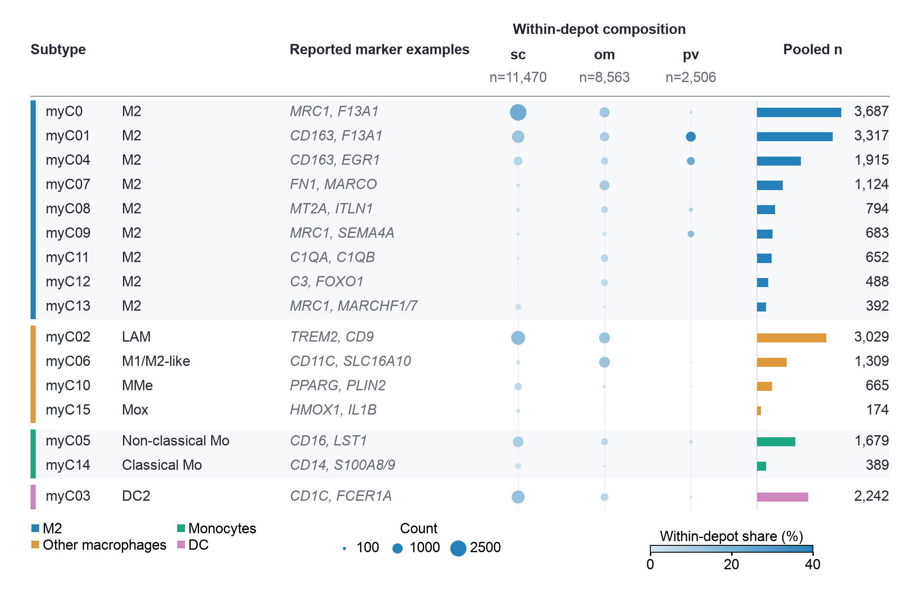

# Myeloid cell atlas: create showcase

This example creates a new annotated dot matrix from real published source data. All 16 myeloid subtypes and all three depots are retained, yielding 48 observations and 22,539 pooled objects. It combines one data matrix with an annotation strip and aligned marginal counts in a single 180 × 120 mm chart.

The exported panel contains its data annotations, column headers, denominators, and legends. Its title, narrative context, abbreviation definitions, and methodological caveats are supplied separately in `caption.md` for manuscript assembly. No panel title, subtitle, narrative footnote, or figure letter is placed on the canvas. The freed space is used for the matrix rows rather than a reserved title band.



## What the chart encodes

| Element | Meaning |
|---|---|
| Rows | All 16 myeloid subtypes, grouped by descriptors in the paper |
| Columns | Subcutaneous, omental, and perivascular white adipose tissue |
| Dot area | Linear in the source object's count, using `88 pt² × n / 2700` |
| Dot color | Percentage of all myeloid objects within the same depot, on a shared 0–40% scale |
| Left annotation | Descriptive subtype group, repeated in the pooled-count bars |
| Marker text | Two reported marker examples per subtype; these are labels, not plotted gene-expression values |
| Right bars and numbers | Pooled subtype counts across the three depots, with a common zero baseline |
| Column denominators | 11,470 subcutaneous; 8,563 omental; 2,506 perivascular objects |

Area and color answer different questions because depot sample sizes differ. A subtype may have a smaller absolute count but a larger within-depot share. The output reports pooled source objects, not subjects; these counts alone do not support subject-level inference or differential-abundance tests. Rare subtypes retain their true small dot areas rather than an artificial minimum size. The vector exports preserve those marks at full precision.

## Files and reproduction

| File | Purpose |
|---|---|
| `source-data.csv` | Complete 48-row source table; all original columns retained |
| `annotations.json` | Descriptors and selected marker examples transcribed from Figure 2d |
| `figure-settings.json` | Physical size, typography, colors, numeric scales, and physical legend positions |
| `plot.py` | Data validation, explicit transformations, chart construction, and export |
| `legend_layout.py` | Shared physical legend layout and complete-bounds checks; bundled with the portable case |
| `caption.md` | Standalone manuscript caption; not rendered inside the panel |
| `data-dictionary.md` | Definitions and reasons for excluding ambiguous auxiliary fields |
| `provenance.json` | Attribution, original file locations, hashes, license, and transformations |
| `output/plotted-data.csv` | Auditable values with explicitly calculated denominators and summaries |
| `output/validation.json` | Numeric and canvas checks performed during rendering |
| `output/figure.pdf`, `.svg`, `.png` | Final individual-panel exports |

Run from any working directory with a Python environment containing the dependencies:

```sh
python /path/to/cell-atlas-dotplot/plot.py
```

The script resolves inputs relative to itself and accepts `--output-dir PATH` and `--settings PATH`. Its runtime dependencies are matplotlib, numpy, and pandas. No author code or bioinformatics analysis software is required. Arial is used where installed; a recorded DejaVu Sans fallback is available elsewhere.

Editing the JSON colors, physical dimensions, or `font_size_pt` and rerunning the script changes the exported files without resizing them after rendering. The data layout uses fixed reference coordinates of 180 × 120 while legend anchors and colorbar dimensions use physical millimeters. Every font role uses the configured physical point size, and dot areas remain in physical pt². Changing the canvas requires reviewing both these coordinate systems. The script checks complete legend bounds, overlap with the declared data field, and canvas clipping; it does not automatically rearrange the data columns to fit arbitrary sizes.

The categorical key uses two compact columns, the count key uses exactly the plotted area mapping, and the continuous key uses a short 32 × 1.4 mm colorbar with endpoints and a midpoint. These are settings for this panel, not general defaults. The shared helper also serves the core renderer and forest recipe. Its measured bounds are recorded in `output/validation.json`, alongside the actual reserved bottom band. Row spacing uses the space recovered from the previous large footer while retaining the 180 × 120 mm canvas and 8 pt text.

`mark_style` controls the common outline treatment for dots, bars, annotation strips and matching legend symbols. The selected setting is `outline: "none"`; `outline: "uniform"` uses one `edge_color` and `edge_width_pt` for all these marks. Axis rules and the colorbar frame have separate structural roles. `size_legend_color` controls the size demonstration marks. Marginal bars use the configured group colors at full opacity.

The renderer recalculates `100 × n / sum(n within depot)` and checks it against the source `percent` field, with a maximum difference of approximately `4.3e-14`. It also checks that every subtype has all three depots, every count is a nonnegative integer, and the pooled subtype totals match source `n_cluster`. No source rows are dropped and no values are imputed.

## Reusable design support

The example demonstrates a create workflow with several coordinated layers: input validation, a declared denominator, a shared quantitative scale, marker annotations, grouped labels, count summaries, proportional symbol sizing, and export at fixed physical dimensions. The annotation table is separate from the plotting code. This script is deliberately specific to the 16-subtype × 3-depot source schema, and its assertions enforce that scope. Reusing the design for another dataset requires adapting and validating its schema, annotations, denominators, and row layout; it is not an automatic renderer for arbitrary data.

The display groups are editorial organization based on the paper's subtype descriptions, not inferred clusters. The source `group` A–D and other auxiliary percentages are retained but not interpreted. This example is a new create-track visualization; it does not claim visual reproduction of Figure 2f.

## Attribution and reuse

Data and published descriptors: Massier et al., *An integrated single cell and spatial transcriptomic map of human white adipose tissue*, Nature Communications 14, 1438 (2023), [doi:10.1038/s41467-023-36983-2](https://doi.org/10.1038/s41467-023-36983-2), Figure 2d and Figure 2f. Source table: `Figure_2f.txt` in the authors' [Source_Data_complete release](https://data.mendeley.com/datasets/y3pxvr4xbf/2).

The article and released source data are licensed under [CC BY 4.0](https://creativecommons.org/licenses/by/4.0/). Changes made here are TSV-to-CSV serialization, selection of descriptive marker examples, explicit calculation of already-supplied percentages, editorial row organization, and a new chart design. The original local materials were not modified.

The user selected blue, amber, teal and pink after comparing three rendered alternatives. These colors come from Cruz Tleugabulova et al. (2024), [Figure 2b](https://www.nature.com/articles/s41467-024-53700-9), as recorded in the `notch2-balanced` preset. The proportion scale is an explicitly derived blue ramp with a stronger light endpoint so borderless low-value dots do not blend into white as easily. The 0–40% linear scale and all count/area mappings are unchanged. Rare positive counts remain truly tiny; no minimum dot size or invented zero replacement is applied.
