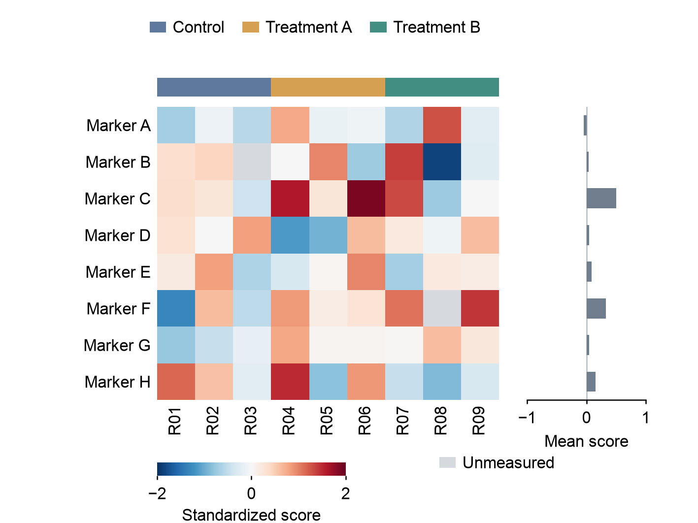

# WorkBuddy v0.4.1 evidence kit

Two bounded, matched synthetic tasks target the v0.4.0 gaps: choosing analysis and
a figure from a noisy multi-table directory, and implementing an unfamiliar
reference with multiple aligned layers. The fixture builder has been run, and
the reference PNG has been visually inspected. The first unattended native UI
attempt had a stale screenshot and did not verify text entry or submission; no external-model output was
verified. See [run status](run-status.json). **No WorkBuddy effectiveness result
is claimed.** Append real observed results if a later attempt succeeds.

Read [protocol](protocol.md) before running. The canonical task bodies are
[create](prompts/create.txt) and [reproduce](prompts/reproduce.txt). WorkBuddy sees
a request restricted to its staged project; the [evaluator directory](evaluator/)
remains outside it. This is an instruction-based boundary, not OS access isolation.

| Resource | Purpose |
| --- | --- |
| `fixtures/create/data/` | Current raw measurements, literal-ID lookup, dictionary, historical/QC/log distractors |
| `fixtures/reproduce/` | Synthetic reference PNG and target user-data directory |
| `fixture-hashes.json` | Canonical source-byte hashes |
| `scripts/stage_conditions.py` | Fresh projects, matched requests, frozen v0.4.0/current skill and input hashes |
| `scripts/audit_outputs.py` | Source/table/export facts, with explicitly bounded font inspection |
| `scripts/prepare_blind.py` | Image-only review packets and separate identity key |
| `evaluator/expected-*.csv` | Numeric truth withheld from WorkBuddy |
| `evaluator/generate_fixtures.py` | Rebuildable original synthetic fixture/reference code |
| `evaluator/kit-smoke.json` | Audit harness checks on synthetic verifier outputs, not Agent quality evidence |
| `evaluator/alias-smoke.json` | Explicit artifact aliases and traversal/symlink rejection checks |

Use the repository's development Python runtime to execute the scripts. Stage
baseline and v040 first; stage v041 only after its runtime changes are ready, so
the resulting snapshot is immutable for that run. Output repairs belong to a new
attempt, never a retrospective edit of a completed original result.

