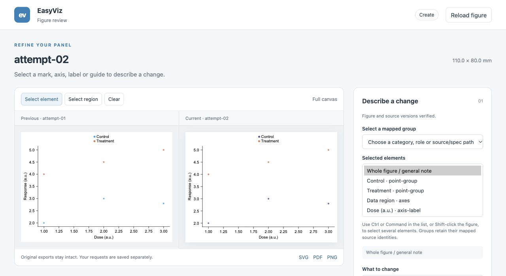

# Actual browser edit and restoration trial

The parent used the Codex in-app browser to select the Control category in a six-observation scatter, save a bulk color request, compare the previous and current SVGs, and inspect applied/accepted history. The adopted panel is 110 × 80 mm with Arial 8 pt. [commands.json](commands.json) retains the actual helper invocations and results.

The current-version request changes Control to `#6A51A3`; both its point group and legend key are selected. The helper prepares a cosmetic specification and explicitly rerenders with the hash-bound installed core. Treatment color, all source values, plotting rows, positions and dimensions are retained. Actual SVG and PDF renders were inspected before acceptance.

The accepted baseline was restored into a fresh directory. [qa-independent.json](qa-independent.json) records seven passing comparisons: changed Control color, unchanged Treatment color/data, and byte-identical restored PNG/PDF/SVG, specification, source and input. This file contains parent comparisons; independent code review is a separate check.

[bulk-request.jpg](bulk-request.jpg) shows semantic bulk selection. [comparison.jpg](comparison.jpg) shows the full comparison and history; [baseline-96dpi.png](baseline-96dpi.png) and [after-96dpi.png](after-96dpi.png) retain nominal-size PDF inspection renders. The temporary browser tab and localhost server were closed after the trial.

An initial request became stale when the source/color version binding changed and was correctly rejected. A redundant record operation was also refused because explicit rendering had already recorded the applied request. These outcomes remain in the command record. Unsupported geometry still requires Agent code changes and a fresh visual review; this trial proves the recorded cosmetic and recovery path only.
