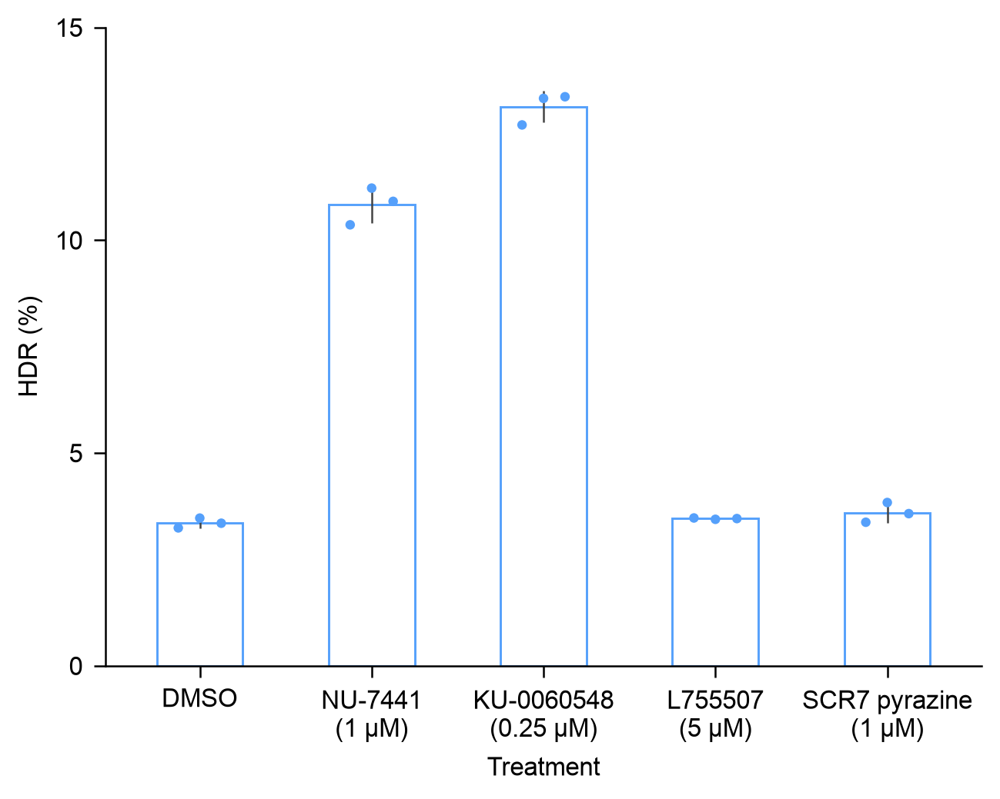
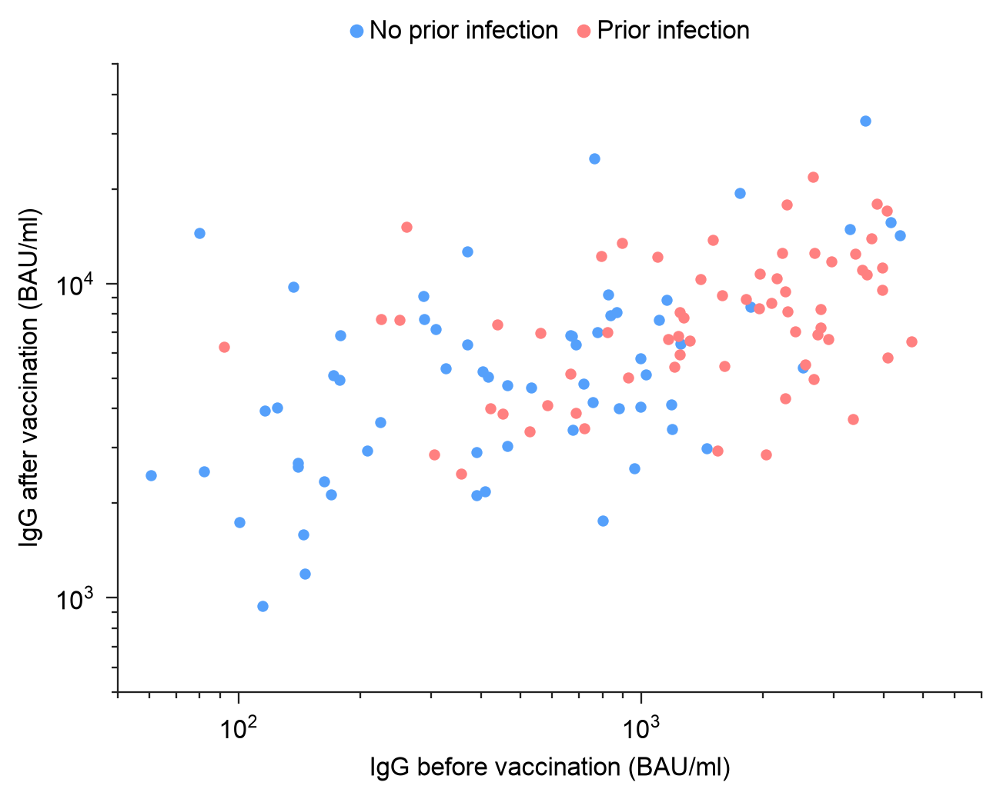
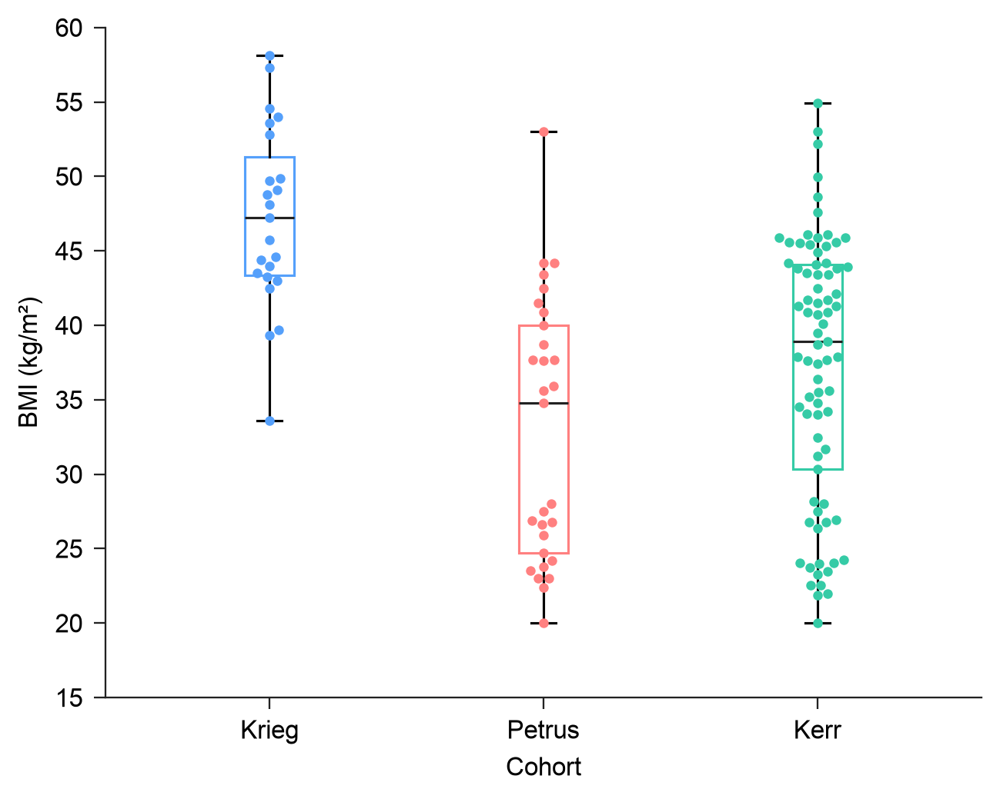
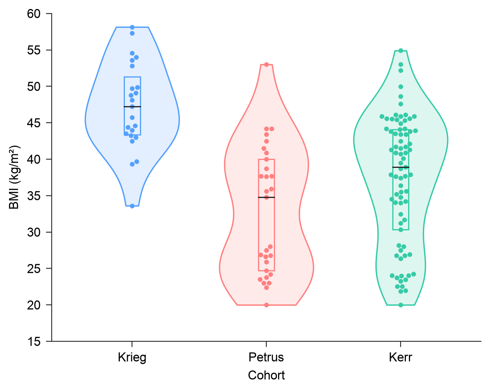
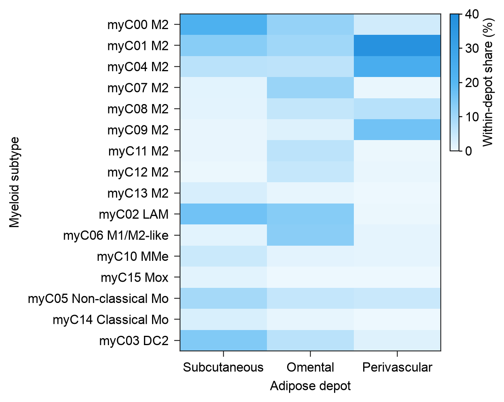

# Basic scientific panels

Five small Create panels use the public EasyViz plotting tools on real,
attributed Source Data. The design task is to make ordinary bars, scatter,
boxes, violins and a heatmap clear at their final size. Each export is a separate
110 × 88 mm panel with 8 pt Arial, a 300 dpi PNG, editable-text SVG and embedded
font PDF. The caption stays outside the image.

The choices below are adjustable design decisions. They do not reproduce an
adopted paper layout, establish journal acceptance, or prove an Agent-wide
quality gain. No fitted trend, hypothesis test or significance mark is added.

| Basic type | Data and reading task | Declared design choice |
| --- | --- | --- |
| [Replicate bars](replicate-bars/output/panel.png) | Fifteen author-supplied HDR percentages: five treatments, three biological replicates each. Read treatment means alongside all observations and sample SD. | One bright blue outcome, outline bars, same-hue opaque points, independently readable dark SD. |
| [Paired scatter](paired-scatter/output/panel.png) | Both IgG measurements from all 127 paired participants. Compare before/after values and the source prior-infection groups. | Clear blue/coral fixed-size points, log display axes, compact group keys; no invented fit or threshold. |
| [Cohort boxes](cohort-box/output/panel.png) | All 129 BMI values in three explicitly selected cohorts. Read median, IQR, whiskers and every raw value. | Narrow open boxes, visible median/whiskers, bright cohort identity, categorical-only beeswarm. |
| [Cohort violins](cohort-violin/output/panel.png) | The same 129 BMI values. Read the estimated distribution shape together with raw observations and quartiles. | Opaque shape boundaries separated from light fills, open inner Q1–Q3 boxes and dark medians. |
| [Depot heatmap](depot-heatmap/output/panel.png) | All 48 source myeloid subtype/depot percentages. Compare within-depot shares on one 0–40% scale. | One linear sky-blue magnitude scale, source order, a clear data-region boundary and a compact quantitative guide. |











## Rerun and adapt

Copy this case into a writable project directory. Keep the installed plugin
unchanged. With Python and the EasyViz runtime dependencies available:

```sh
python plot.py --tools /path/to/easyviz/scripts --out /path/to/writable/figures
```

Use `--case cohort-box` to render one case, or `--font "DejaVu Sans"` to explicitly
adopt an installed font on a host without Arial. The saved settings record the
actual font and the adopted override; this leaves the 8 pt text sizes and
physical canvas intact. There is no special renderer inside this case:
`replicate_plot.render` draws the bars, and `render.render` draws the other four.

Each case contains `source-data.csv`, `candidate-spec.json`, `caption.md` and
`provenance.json`. Change the mapped fields, source data and specification
before rerendering. Do not copy the example's experimental unit, SD assumption,
KDE definition or percentage denominator into an unrelated dataset.

## Equal-data comparison and bounded transfer

`baseline-spec.json` uses the earlier tool's omitted-option defaults on the
same prepared input. `first-render/` freezes those exports. The main candidate
retains source values, numeric limits/normalization, labels, font sizes and
canvas. Colors, categorical mark treatment, widths and raw-point placement are
explicit design choices. The violin candidate also adds a declared raw-scale
Q1/median/Q3 summary, so that comparison is **not solely cosmetic**; its KDE
method and input values stay the same.

Each `transfer/` contains a real-source probe, rather than new simulated
biological evidence, and its own `caption.md` describing the changed subset or
measurement outside the image:

| Case | What the probe changes |
| --- | --- |
| Replicate bars | Renamed fields, four source treatments, source-supplied mutEJ rather than HDR percentages, and a 0–55% range. |
| Paired scatter | Renamed fields, the complete 63-person no-prior-infection stratum, and no optional color grouping. |
| Box and violin | Renamed fields and the complete additional Arner, E cohort: four groups and 185 observed BMI values. |
| Heatmap | Renamed fields and actual source object counts on the same 16 × 3 matrix, with a separately justified 0–2700 scale. |

```sh
python plot.py --tools /path/to/easyviz/scripts --transfers
python validate.py --tools /path/to/easyviz/scripts
```

`--transfers` preserves the frozen baseline. `--comparisons` explicitly regenerates
it. The compact portable case retains the comparison specifications and probe
inputs, while historical comparison images belong to the development checkout.
Use `validate.py --candidate-only --outputs /path/to/writable/figures` when only
the five final panels have been rendered. Match any explicit `--font` override
when validating those outputs.

The checks independently recompute mean/SD and quartiles, examine raw numeric
artist coordinates and matrix order through the public renderers, and inspect
the saved PDF/SVG dimensions, PDF font embedding and PNG resolution. Rebuilt
artist checks are distinguished from actual saved-export checks. Technical QA
and small transfer probes do not replace independent visual inspection or a
new-model evaluation.

An independent reviewer opened all 15 baseline/candidate/transfer PNGs and all
15 PDF-derived 96 dpi previews individually. No critical or major visual issue
was found. The reviewer preferred the candidate bars, boxes, violins and this
heatmap for their declared reading tasks, with no clear preference for the
scatter. Nearby scatter observations still touch in both versions. The violin
preference includes its added quartile layer. This is a scoped visual judgment
on these supplied cases; the review did not establish source/statistical
correctness, color-vision accessibility, physical print quality, model
advantage or publication acceptance. The separate transfer captions were added
after that review without rerendering any image.

## Source attribution

- Bars: Truong et al. (2024), *Exonuclease-enhanced prime editors*, Nature Methods,
  [DOI 10.1038/s41592-023-02162-w](https://doi.org/10.1038/s41592-023-02162-w),
  Source Data sheet `Fig. 1b`, rows 4–8. The two control rows are explicitly outside
  the five-treatment display. No source number is reconstructed from pixels.
- Paired scatter: Urschel et al. (2024), Nature Communications,
  [DOI 10.1038/s41467-024-47429-8](https://doi.org/10.1038/s41467-024-47429-8),
  source sheet `figure 2`, all 127 paired rows and 254 measurements.
- BMI and myeloid shares: Massier et al. (2023), *An integrated single cell and
  spatial transcriptomic map of human white adipose tissue*, Nature Communications,
  [DOI 10.1038/s41467-023-36983-2](https://doi.org/10.1038/s41467-023-36983-2),
  [source release version 2](https://data.mendeley.com/datasets/y3pxvr4xbf/2).
  BMI uses all observations in the three named cohorts; the heatmap uses the
  entire `Figure_2f.txt` table. Source pooled object counts are not independent
  participant replicates.

All three source releases are attributed under
[CC BY 4.0](https://creativecommons.org/licenses/by/4.0/), as documented in the
repository's existing source provenance. The prepared input hashes, selections,
original row/cell identifiers, units, denominators and adaptations are retained
in each case's provenance and separate caption.
