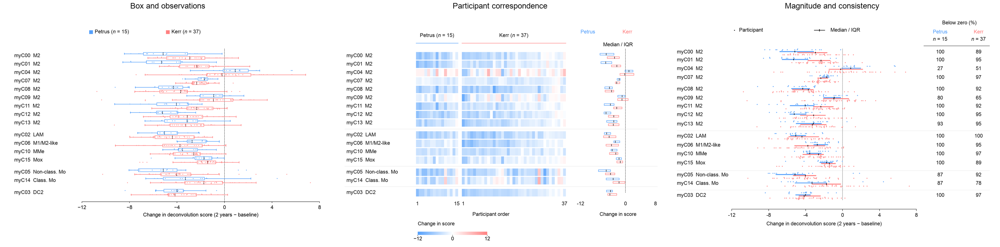
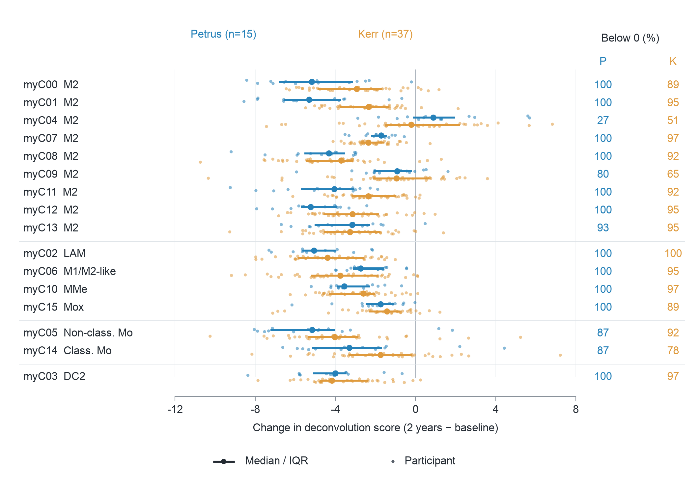

# Paired myeloid remodeling

This create-track case asks two related questions of published, already-computed source data: which myeloid subtypes change consistently after bariatric surgery, and whether changes co-occur within the same participants. The challenge is retaining **832 matched participant–subtype changes** across **16 subtypes and two cohorts** while making cohort distributions and participant structure readable in a single final-size panel.

This is a design comparison, not a claim that a custom layout always improves a conventional chart. All three candidates use the same data, 180 × 125 mm canvas, Arial 8 pt, source-derived row annotations, and unchanged score units. No author plotting code was read or reused.

| Candidate | Reading task | Intentional tradeoff |
| --- | --- | --- |
| [Baseline](output/baseline/panel.png) | Familiar comparison of paired-change distributions | Boxplots, whiskers and individual points are recognizable; participant identity across rows is not retained visually. |
| [Participant matrix](output/participant-matrix/panel.png) | See participant-coincident change across cell subtypes | One participant keeps one column; color sacrifices precise numeric reading, and the median/IQR margin is only a compact cohort summary. |
| [Distribution ledger](output/distribution-ledger/panel.png) | Compare magnitude, spread, and the fraction of participants with negative changes | Uses positional encoding for the exact change and a shared zero; it still cannot show cross-subtype participant correspondence. |

The matrix is useful when participant structure is the question. The distribution ledger is useful when comparing the size and consistency of subtype changes. The baseline remains an admissible choice for readers who need standard boxplot summaries. A design review should select for the stated task, not select whichever candidate has more layers.

<p align="center"></p>

The adopted distribution ledger uses one shared −12…8 axis. Each subtype has
adjacent blue Petrus and coral Kerr participant tracks, with filled IQR strips
and dark median ticks between them. This makes the cohort summaries directly
comparable without looking between two distant fields. Two compact percentage
columns share the same subtype rows.

<p align="center"></p>

All 832 observations remain at their exact quantitative positions. The ledger
uses 1.4 pt opaque filled circles, compared with 1.2 pt circles in the
conventional baseline. Deterministic tangent packing and a bounded linear
repair place the raw circles in physical units; row room is measured from their
actual extents. The raw tracks and summary strips remain separate, and the
supplied subtype order and annotation-defined groups stay intact. Vertical
packing and spacing have no quantitative meaning. The saved audit re-reads the
actual scatter positions, checks every raw circle pair across all rows/cohorts,
and checks the complete circle edges against the data field. Individual values
remain small at manuscript size and can be inspected in the vector export or
`participant-placement.csv`; the summary strips carry the first comparison.

The blue/coral pair (`#55A0FB` / `#FF8080`) was observed in the vector strokes of
Figure 2 on PDF page 4 of the [scWAT study](https://doi.org/10.1038/s41467-023-43021-8).
It is reassigned to Petrus/Kerr here as an EasyViz design decision. Figure 2 of
[Vanneste et al.](https://doi.org/10.1038/s41590-023-01468-3) informed compact
repeated categories and purposeful thin axes. The shared-axis organization,
filled IQR strips, and density-dependent row room are case-specific design
choices. Neither paper's biological groups or statistics are transferred.
No author plotting code was used. The matrix retains its symmetric −12…12
score scale. Data, quartiles, percentages, participant ordering and 8 pt
manuscript text remain unchanged.

Two materially different revisions were inspected at the same physical size:
a stronger-summary version of the two cohort facets, and the adopted shared
axis. Both the implementing agent and an independent reviewer preferred the
shared axis for direct comparison and less duplicated furniture. The final
panel received a second visual pass; `visual-review.json` records this bounded
review and its limitations.

## Source and scientific meaning

Data are from Massier et al., *Nature Communications* 14, 1438 (2023), [DOI: 10.1038/s41467-023-36983-2](https://www.nature.com/articles/s41467-023-36983-2), source workbook `Figure_8d_8e.xlsx`. The paper and its source dataset are attributed under [CC BY 4.0](https://creativecommons.org/licenses/by/4.0/); see [provenance.json](provenance.json).

The main comparison uses all 15 paired participants in the Petrus sheet and all 37 paired participants in the Kerr sheet at baseline and two years. Every `Myeloid_*` column is included. The tidy input also retains Kerr five-year scores for a second-input evaluation. These are deconvolution **scores**, not measured cell proportions, cell counts or percentage points. The script performs paired subtraction and descriptive summaries only; it does not run deconvolution or any other upstream bioinformatics method.

Source Figure 8e and the workbook annotation identify the paired time points. The source uses `Före`/`Efter` in the Petrus sheet and `B`/`C`/`D` in the Kerr sheet; these are mapped to baseline/two/five years. The score normalization is taken as supplied and is not re-estimated. Cohorts are kept separate; their differences are descriptive and are not a cohort-effect estimate.

## Re-run and transfer

```bash
python plot.py
python plot.py --year 5 --cohorts Kerr --design participant-matrix --out transfer-five-year
```

The second command uses the same recipe without code edits on **592 different paired changes**: 37 Kerr participants × 16 subtypes, five years minus baseline. Its [output](transfer-five-year/participant-matrix/panel.png) and [audit](transfer-five-year/qa.json) are included. It demonstrates reuse for another time-point/cohort selection from the same source, not generalization to arbitrary source schemas or scientific domains.

Rendering uses the prepared CSV and the standard EasyViz runtime. The reviewed
previews use the project runtime recorded in `qa.json` (Matplotlib 3.11.1).
`standalone-verification.json` records exact fresh-CLI PNG replay, an inherited
caller-style check, and an actual one-participant, one-subtype export. Repeating the optional workbook conversion with `prepare.py` additionally requires `openpyxl` and the caller-supplied original workbook.

To supply another source, use `--data` with `cohort`, `participant`, `year`, `subtype`, and `score` columns, a matching `--annotations` JSON, and explicit `--settings`. Duplicate records, non-finite scores, missing pairs, incomplete subtype coverage and values outside the declared common axis are refused. This physical layout supports up to 16 subtypes and one or two cohorts; matrix columns must remain at least 1 mm wide, and matrix color limits must include every observation; larger problems need a layout decision rather than smaller type.

## Files

- `source-data.csv`: 2,256 source scores, with worksheet, Excel row and source column for every value.
- `prepare.py`: one-time source-workbook conversion; the local workbook path is supplied by the caller.
- `plot.py` and `figure-settings.json`: common rendering and statistical instructions for all candidates.
- `output/paired-changes.csv`, `summary.csv`, and `participant-order.csv`: exact plotted data and ordering.
- `output/participant-placement.csv`: exact changes and physical point centers for every distribution-ledger observation.
- `output/<candidate>/panel.pdf`, `.svg`, and `.png`: separate fixed-size scientific panels.
- `output/comparison.png`: a review board generated alongside all three candidates; it does not replace their individual manuscript exports.
- `caption.md`: the caption text, supplied outside the panel.
- `design-rationale.md`: reusable selection conditions and failure modes.
- `numeric-verification.json`: independent comparison with the original workbook.
- `visual-review.json`: inspected candidate identities, comparison reasons, final visual findings, runtime correction and limitations.
- `standalone-verification.json`: exact PNG replay in the recorded runtime and the single-pair export check.

Each output audit records the physical PDF page size, text sizes, missing-pair count, source hash and physical point packing. The PDFs were rendered and viewed at 96 dpi as a final-size reading proof and at higher resolution for mark detail. Automated bounds and circle-spacing checks complement visual review; they do not establish aesthetic superiority.
