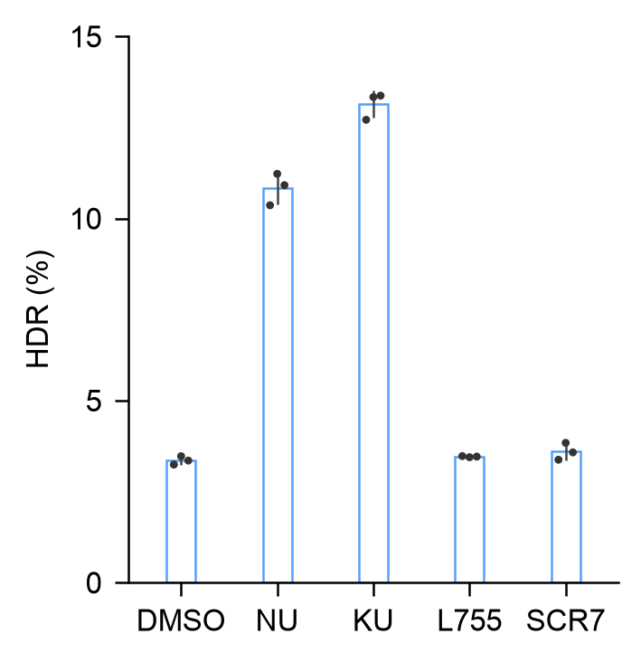

# Create · repair outcomes as individual manuscript panels

The reading task is to compare five treatments within each author-supplied
repair outcome. Three **72 × 48 mm** panels use neutral open means, graphite
replicate marks and sample-SD intervals, repeated treatment order, and
**Arial 8 pt**. Each is an independently exported PDF, SVG and PNG. HDR is shown
below; the table links all three outcomes in their original percent units.



| Individual panel | Original-percent range | Source observations |
| --- | --- | --- |
| [HDR](panels/hdr/output/panel.svg) | 0–15% | 15 |
| [HDR and mutEJ](panels/both/output/panel.svg) | 0–6% | 15 |
| [mutEJ](panels/mutej/output/panel.svg) | 0–55% | 15 |

## Decisions and scientific meaning

Neutral open bars show arithmetic means, dark dots retain all three biological repeats
per treatment, and intervals show sample SD. The ranges differ explicitly,
so readers compare treatments **within** each outcome; equal heights in two
panels do not represent equal absolute amounts. No outcome is normalized,
stacked or transformed to manufacture a composition.

The user-directed 2026-10-05 overhaul adopts a shorter landscape region for
these five-condition, single-outcome comparisons. This replaces this case's
previous physical size; it does not resize the frozen v0.4.3 evidence or set a
general manuscript default. The data rectangle is **57.24 × 37.44 mm**
(width/height **1.53**), compared with the previous 45.90 × 51.15 mm (0.90).
Bars occupy **0.45 of condition pitch**, compared with 0.30 previously. At the
actual five-condition axis range, each bar is 5.05 mm wide, its inter-bar gap
is 6.17 mm, and the gap/bar ratio is 1.22. All three raw points remain separate
across each bar. Extremely small SD intervals can be shorter than a raw-point
glyph; their numerical endpoints are preserved.

Neutral open and subdued single-hue filled treatments were rendered on all
three outcomes. Open neutral means were selected because x labels already
decode treatments and the y label already identifies the outcome; three
outcome hues would add a role this individual-panel task does not need.
The comparison, old specifications/images, measured geometry and review are
retained in [the overhaul evidence](https://github.com/idealstarry/EasyViz/tree/main/evals/create-purpose-overhaul-v0.4.4/repair-outcomes).
An [unscaled row preview](output/panel.png) joins all three individual exports
at their adopted physical sizes; its different ranges still require
within-outcome comparisons.

The short treatment labels fit a narrow manuscript panel without shrinking
text. DMSO is the vehicle; NU = NU-7441 (1 µM), KU = KU-0060548 (0.25 µM),
L755 = L755507 (5 µM), and SCR7 = SCR7 pyrazine (1 µM). Exact source names,
concentrations, decimal value strings and workbook-cell identities stay in
[source-data.csv](source-data.csv) and each panel's plotting table. The
[caption](caption.md) carries this definition and the scientific limits.

The 45 real values are from Truong et al., Nature Methods, DOI
10.1038/s41592-023-02162-w (CC BY 4.0). The selected rows contain all five drug
conditions, three outcomes and three biological replicates. The
‘No donor/Cas9’ and ‘NTC’ controls are explicitly excluded from this declared
drug-comparison subset. This descriptive plot introduces no hypothesis test,
cross-condition pairing or new biological conclusion.

An optional [grouped alternative](grouped-output/panel.png) answers a different
reading task: compare absolute outcome magnitudes on one global 0–55% scale.
It has explicit within-treatment gaps, verified against actual outline stroke
edges. The individual view remains the main presentation when outcome ranges
would compress smaller responses into short bars. Both layouts are retained;
neither complexity nor more values establishes publication quality by itself.

## Run and adapt

```sh
python /path/to/repair-outcomes/plot.py --out /writable/figure
python /path/to/repair-outcomes/plot.py --transfer --out /writable/probes
python /path/to/repair-outcomes/validate.py --outputs /writable/probes --out /writable/validation.json
```

Supply `--tools /path/to/easyviz/scripts` when copying the case outside the
plugin. `--font "DejaVu Sans"` explicitly chooses an available alternative;
use the same override when validating exports. Copy the case into a writable
project before editing its specifications.

`plot.py` delegates all data drawing to the public `replicate_plot.py`.
`compose.py` joins the already exported vector panels without resizing fonts
or redrawing data; original individual panels remain the manuscript files.
The bounded [transfer](transfer/panel-manifest.json) reverses source rows and
uses four treatments and two outcomes: two individual panels retain all 24 real
values, at the same 72 × 48 mm size and neutral mark roles. It checks the
repeated layout and source identity, rather than a new
biological population.

[Provenance](provenance.json) records selection and limits.
[Validation](validation.json) checks every raw value, outcome-specific mean/SD,
source-to-artist coordinates, actual dimensions and fonts. It also checks
unchanged text positions in the assembled PDF and unique SVG identifiers.
Independent image review is recorded separately in the refinement report;
numerical checks do not rank aesthetics or measure model-wide improvement.
