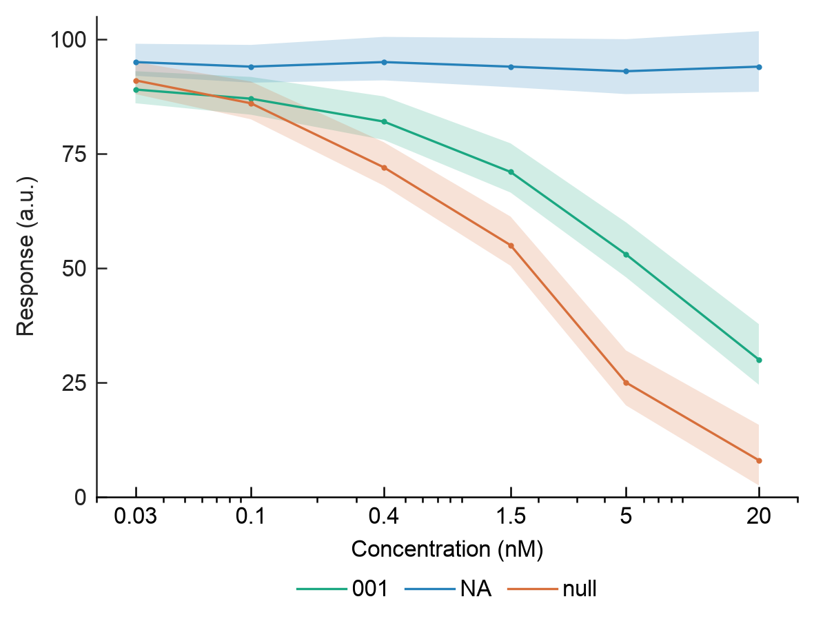

# Image-data reproduction of a dual-axis time course

[Shi et al., Nature Communications (2021), Figure 1d](https://www.nature.com/articles/s41467-021-22092-5)
is a different reading task from distributions, paired point clouds or forest
intervals: compare the time evolution of two dimensions, with separate y
scales and supplied uncertainty. This case uses the reference image, source
summaries and caption evidence. No author plotting code is read or required.


```sh
python plot.py
```

The generic `timecourse_plot.py` recipe renders all 120 summary rows: width and
length at every minute from 1 to 60, each with supplied mean and SD. Exports
are PDF, SVG, PNG and TIFF at 100 × 76 mm with 8 pt Arial text. The source
panel's letter is omitted and the full scientific explanation is separate in
`caption.md`. `adopted-spec.md` records estimated colors and the expanded
width-axis bounds that keep the entire supplied SD band visible.

For another installed font, explicitly adopt it with `--font "DejaVu Sans"`.
For a copied case outside the repository, pass
`--runtime /absolute/path/to/easyviz/scripts`; keep the shared sibling helpers
together. The resolved settings record actual font, input/spec/runtime hashes
and axis limits. Installed plugin assets should be copied to a writable
project before editing or rendering.

The source sheet contains summaries, not 146 individual cell trajectories.
The caption's 146 cells are not assumed to be independent biological
replicates. SD remains SD; no raw-data imputation, smoothing, model fitting,
inferential test or confidence interval calculation is performed. Separate
width and length scales must be read using their respective axis labels.
Straight segments join the supplied summaries without adding measured times.

`source-audit.md`, `source-checks.json` and `provenance.json` identify the DOI,
public source workbook, licence, hashes and exact worksheet coordinates.
All 360 numerical XML strings are retained unchanged in `source-data.csv`.
The case extractor can repeat the extraction from the official workbook.
`reference-reading.md` preserves the fresh independent reader's image/caption
observations before case implementation selection.

## Changed-data transfer

```sh
python plot.py --data transfer-reproduce/source-data.csv --spec transfer-reproduce/spec.json --out transfer-reproduce/output
python plot.py --track create --data transfer/source-data.csv --spec transfer/spec.json --out transfer/output
```

`transfer-reproduce/` keeps the reference's two colored y axes, summary lines,
and SD bands, while changing all mapped column names, category labels,
the x grid and all numeric values. All 12 synthetic summaries are shown with
explicitly adopted bounds. Its track remains reproduce because the reference
still defines the geometry; it is unrelated to the paper's measurements.

The separate `transfer/` fixture changes every field name, uses three literal
series identifiers (`001`, `NA`, `null`), six irregularly spaced concentrations,
a log x axis and asymmetric supplied bounds on one shared y axis. All 18 rows
are retained. It demonstrates field mapping, source sorting, literal category
preservation and changed geometry; it is not an experiment from the paper and
does not establish a dose-response fit or confidence-interval coverage. It
explicitly uses create because its single shared y axis and dose reading task
are selected from new data rather than reconstructed from the reference.



The three `output/qa.json` records inspect actual mean and band
vertices, colors, transforms, source-row membership, clipping and full export
dimensions. `elements.json` identifies curve, band and axis-label elements for
precise Agent instructions that modify code/specification and redraw the
scientific output. Numerical data coordinates remain tied to the source.

`evals/reproduce-inputs/shi-timecourse/export-verification.json` in the
repository records direct physical dimensions, embedded PDF fonts and source
audits for all three views. The focused runtime tests also require SVG paths
to retain all 60 means and full band edges for each paper curve.

The source article, selected data and cropped reference are credited to Shi
and colleagues under [CC BY 4.0](https://creativecommons.org/licenses/by/4.0/).
This is a selected data subset and adapted plot. See `independent-review.md`
for the reviewed candidate hashes, visual findings and remaining differences.
