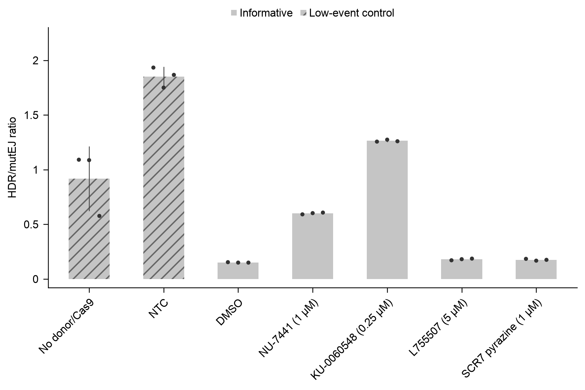
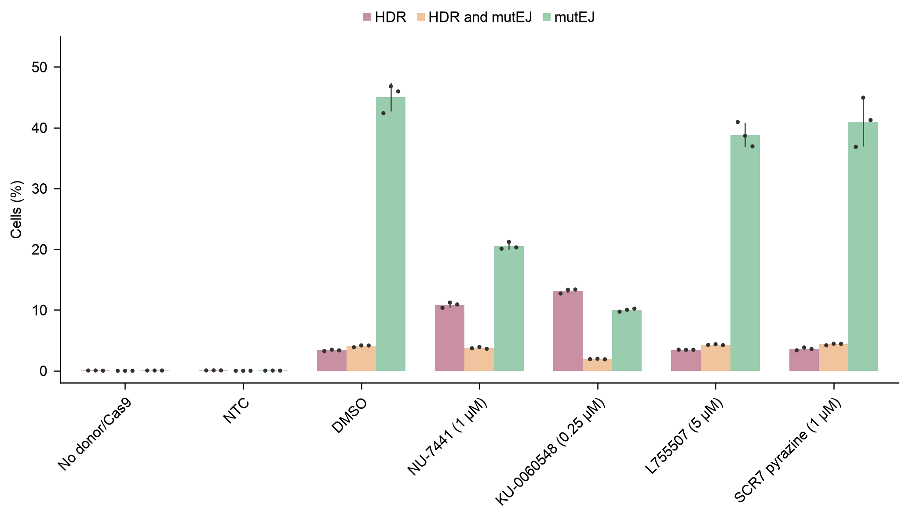

# Replicate components and supplied ratios

This case adapts real Source Data from [Truong et al., Nature Methods 2024, Fig. 1b](https://www.nature.com/articles/s41592-023-02162-w/figures/1). It introduces a reusable component-bar recipe with raw replicate observations and defined sample SD. The selected official workbook contributes all **84 numerical values**: 7 conditions × 3 biological replicates × 3 component percentages plus 21 separately supplied ratios.






The stack shows mean component percentages; dots and SD describe per-replicate **totals**. The ratio panel uses the supplied ratio observations directly. Its two low-event controls retain their values and use hatch marking. The grouped alternative instead shows each component's own observations and sample SD.

The original dual-axis layout and ambiguous interval positioning are replaced by separately defined views. This is a **create adaptation**, with differences documented in [adopted-spec.md](adopted-spec.md), not an exact reproduction or three different published panels. Captions are separate from the panels: [components](caption-components.md), [ratios](caption-ratios.md), [grouped](caption-grouped.md). No tests or P values were reconstructed.

## Run and adapt

```bash
python /path/to/case/plot.py --out /path/to/output-components
python /path/to/case/plot.py \
  --data /path/to/case/inputs/ratios.csv \
  --spec /path/to/case/ratios-spec.json --out /path/to/output-ratios
python /path/to/case/plot.py \
  --spec /path/to/case/grouped-spec.json --out /path/to/output-grouped
```

Pass `--runtime /path/to/easyviz/scripts` if the case has been copied away from the plugin. The wrapper invokes the reusable `replicate_plot.py` and its sibling helpers; it does not contain an author plotting program. Change the field mapping, condition/component order, supplied data, colors, canvas and typography explicitly for a new task. Missing unit-component cells are rejected, while supplied zeros remain values.

Each output includes plotted observations, computed summaries, settings, numeric/layout QA and PDF/SVG/PNG/TIFF at the adopted dimensions. Confirm `qa.json` says `valid_outputs: true` and inspect the actual image; automatic checks cannot establish manuscript readiness on their own.

## Source and attribution

[provenance.json](provenance.json) records the official archive URL/SHA, selected worksheet rows/cells, reference crop and license. [source-audit.json](source-audit.json) records all source-preserving extraction checks. Full archives stay outside the portable case. The workbook's two repeated dash labels are disambiguated from the published axis/caption. Labels use official Source Data spelling (`KU-0060548`); the raster appears to read `KU0060648`, so this difference is disclosed rather than silently corrected.

Source: Truong, DJ.J., Geilenkeuser, J., Wendel, S.V. et al., *Exonuclease-enhanced prime editors*, Nature Methods 21, 455–464 (2024), DOI [10.1038/s41592-023-02162-w](https://doi.org/10.1038/s41592-023-02162-w), licensed under [CC BY 4.0](https://creativecommons.org/licenses/by/4.0/). Selected numerical data were converted to CSV; the reference was cropped from the official PDF; new plotting layouts and explicitly defined total-value layers were created. No author plotting code was inspected or bundled.

[Independent visual review](independent-review.md) records the inspected final images, candidate hashes, export checks and remaining adaptation notes.
