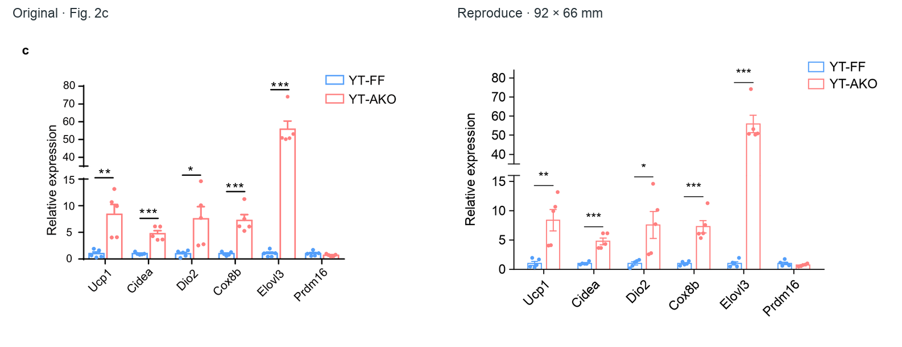

# Reproduce · grouped bars with a broken y axis



Huang et al., [Nature Communications 2023, Fig. 2c](https://www.nature.com/articles/s41467-023-43021-8/figures/2), [CC BY 4.0](https://creativecommons.org/licenses/by/4.0/). The original is a cropped excerpt; the right-hand panel is newly drawn from all **60 real source observations**. The comparison normalizes screen preview width, not unknown original font sizes or print-size equivalence.

The useful mechanism is **two linear y segments sharing one categorical frame**. It retains crisp open bars, five source observations per gene/genotype, mean/SEM, matching blue/red roles, and author-reported significance classes. Bar edges have a visible within-group gap; the tall Elovl3 outline is continuous through the physical axis gap, as in the reference. Every observation and SEM endpoint must remain in a displayed numeric segment.

The **92 × 66 mm** output is an explicitly adopted individual panel with 8 pt text throughout. Source physical crop bounds are recorded in [provenance](inputs/provenance.json); exact source fonts remain unknown. The original `c` is omitted, full SEM endpoints are visible, and axis limits are explicitly adopted. See the separate [caption](caption.md) for scientific context, methods, unknowns and attribution.

## Run and inspect

With the standard EasyViz scientific dependencies installed:

```sh
python plot.py --out /your/project/attempt-01 --tools /path/to/easyviz/scripts
python validate.py --out /your/project/attempt-01
```

The renderer refuses to replace existing exports. It generates fresh SVG/PDF/PNG, actual source-to-artist tables, selectable element bindings and a captured-input handoff. The font must exist; adopt a different installed font explicitly in a copied `spec.json` if necessary. Script success means technical/numeric checks were performed, not that a new input received an independent visual review.

The canonical font is Arial. On a system without it, use `--font "DejaVu Sans"`
for an explicit portable override; this saves a distinct consumed
`adopted-spec.json`, retains the original spec as an auxiliary input and keeps
the agreed 8 pt text sizes. It never silently substitutes an unavailable font.

## Reuse with your own data

Supply UTF-8 CSV fields `observation_id`, `gene`, `display_gene`, `group`, `relative_expression`; IDs must be unique. Declare the actual ordered gene/group domains, physical size, font and two y segments in a copied spec. This focused custom route uses exactly two groups and at least two independent observations per gene/group for mean/SEM. The experimental-unit meaning must be established outside numeric eligibility. A source-column number does not prove independence or pairing.

```sh
python plot.py --data /your/project/measurements.csv \
  --p-values /your/project/reported-comparisons.csv \
  --spec /your/project/adopted-spec.json --out /your/project/attempt-01 \
  --tools /path/to/easyviz/scripts
```

The supplied-comparison CSV needs `gene` and `reported_p` once per gene. Use supported numeric P values or a supplied `<` bound; do not invent tests to mimic stars. For a new task without established comparisons, explicitly remove that layer in the adoption plan and adapt the custom script rather than borrowing literature P values. Data or SEM endpoints inside the omitted numeric interval cause a clear error: adopt different segments or an unbroken scale. Never discard inconvenient points. Wider category counts/longer labels require a new layout and actual image review, not automatic shrink-to-fit.

This demonstrates a bounded reusable coordinate relationship. It does not make this palette, broken axis or complete layout the default for Create, nor require runtime references to publish data or author code.

## Source extraction and evidence

[Observations](inputs/observations.csv) preserve the stored XLSX numeric strings and cell addresses. [Reported P values](inputs/author-p-values.csv) preserve six original entries. The complete upstream workbook is intentionally not included in every installation; its primary-source download is linked in the provenance.

```sh
python extract_source.py --workbook /path/to/41467_2023_43021_MOESM8_ESM.xlsx \
  --out /your/project/extracted-inputs
```

No author plotting code was read or executed. The independent reader saw only the original crop and caption excerpt before implementation. Historical numerical extraction, actual-vector checks and visual findings are retained in the repository's [development record](https://github.com/idealstarry/EasyViz/tree/main/evals/development-v0.5.0/scwat-broken-axis). Saved gallery exports are examples; redraw into a fresh local folder before using them with the workbench.

The canonical Arial 8 pt panel received an independent `ready_with_notes`
review at its fixed size. Compact low-value points can still overlap, and
outlines/comparison guides are slightly lighter than the reference; neither
note changes source values or the adopted coordinate relationship. The linked
development record distinguishes this final review from the earlier typography
attempt and includes a separate synthetic user-data transfer check.
