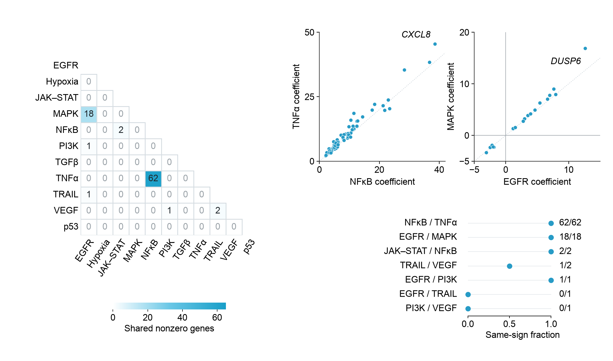

# Create · pathway signature relationships

Which published PROGENy signatures share response genes, and how do those
genes’ signed model weights relate? This **Create** case combines all 55 pair
overlaps, the complete paired coefficients for the two major overlaps, and
sign fractions for all seven nonempty pairs. These are model coefficients;
no pathway activity, fitted correlation or causal cross-talk is computed.



[Caption](caption.md) · [Design decisions](https://github.com/idealstarry/EasyViz/blob/main/examples/create/pathway-signatures/design-notes.md) ·
[Input contract](inputs/input-contract.json) · [Specification](spec.json) ·
[PDF preview](output/panel.pdf) · [SVG preview](output/panel.svg)

## Re-run with local-current records

The packaged PNG/PDF/SVG files are frozen reviewed previews. Re-run the copied
case into a fresh directory to generate its actual local artist map, settings,
QA, source receipt and derived tables:

```sh
python /path/to/case/plot.py \
  --tools /path/to/easyviz/scripts \
  --out /absolute/path/to/a/fresh-output
python /path/to/case/validate.py \
  --out /absolute/path/to/a/fresh-output
```

The default is **Arial, 8 pt, 190 × 112 mm**. An unavailable font stops export;
use an explicit `--font 'DejaVu Sans'` override, then validate and inspect its
actual output. The case uses the installed EasyViz runtime and export
dependencies; independent validation additionally needs PyMuPDF. No network,
browser, PROGENy package or author code is needed to regenerate the panel.

Generation parses the captured CSV, specification and contract bytes directly,
and checks the actual executing case/renderer/helper sources before drawing.
The fresh output’s `handoff.json` and `consumed-sources.json` bind those declared
inputs to the actual exports. They do not certify aesthetics or discover every
third-party dependency. For local figure review, point the workbench at this
fresh output rather than claiming the packaged preview has current machine
paths or metadata.

## Source and evidence

The complete **1,013 × 11** coefficient matrix and copied official workbook
are retained. Structural zeros identify unselected coefficients; 48 empty pair
overlaps stay visible, and their sign agreement is undefined. The coefficient
views explicitly select every pair with **more than 10 shared genes** (62 + 18
points); the remaining shared coefficients are retained in the generated table.
The separate caption explains counts, Jaccard, denominators and exclusions.

The validator reads literal XLSX cells, independently derives all pair
quantities and checks real vector coordinates, source identities, glyphs,
physical exports and current consumption records. The known-source image is
independently `ready_with_notes`: true near-origin coefficients remain crowded,
and 1/1 fractions need their explicit denominator. This scoped review does not
establish general aesthetic superiority.

[Full current output and pair tables](https://github.com/idealstarry/EasyViz/tree/main/examples/create/pathway-signatures/output) ·
[Independent review evidence](https://github.com/idealstarry/EasyViz/tree/main/evals/development-v0.4.6/pathway-signatures-review) ·
[Rebinding and development history](https://github.com/idealstarry/EasyViz/tree/main/evals/development-v0.4.6/pathway-signatures-capture)

Complete QA, handoff and review packets stay in the source repository. The
portable case includes runnable inputs, attribution, design notes and frozen
previews; its re-run creates new records for the actual local files.

The bundled exports are frozen previews. Redraw this copied case into a fresh writable directory to create current source bindings, QA, selectable elements and a handoff receipt. Development review/history links refer to the original repository records.
