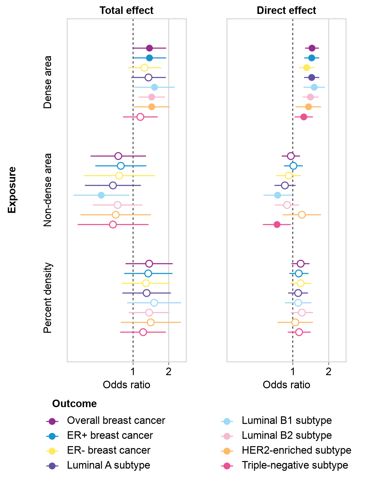

# Paired forest lanes

This revision restores the published figure's two narrow lanes, three exposure blocks and one shared eight-outcome key. It retains every supplied odds ratio and asymmetric 95% confidence endpoint, including the source filled/hollow states. Per-estimate sample sizes remain unknown.



The explicitly adopted canvas is **100 × 132 mm**, with two **32 × 92 mm** data lanes and editable **8 pt Arial** text. The paper's measured data lanes are approximately 34.84 × 100.21 mm: the revision retains their width/height relationship. Source forest glyphs are outlined paths, so their original font sizes cannot be recovered from PDF text metadata. The earlier standalone repeated-label outputs stay intact in the parent case.

Copy the whole case to a writable project directory. Keep `revision-v0.4.6` beside the parent `inputs` directory, then run:

```sh
python /path/to/case/revision-v0.4.6/plot.py --runtime /path/to/easyviz/scripts --out /path/to/project/forest
```

Use EasyViz **0.4.6 or later** and its Python dependencies. Default exports require Arial. On another system, explicitly add `--font "DejaVu Sans"` to adopt that installed family; the point sizes stay 8 pt, and the output saves both the original specification and the adopted override. No font is silently substituted. Use a fresh output folder; `--overwrite` archives an existing attempt before redrawing.

The script exports a full-canvas PDF, SVG, PNG, source snapshot, literal plotting data, live-artist checks, actual settings, a source-bound element map and a consumed-byte `handoff.json` for the review workbench. Declared data, specification, script and helper inputs are captured before drawing and checked again after export. Technical QA covers values, bounds, physical exports and editable fonts. Visual quality still requires inspection of the real files at their adopted size.

The [adopted specification](adopted-spec.json) states all layout choices. Methods and limits are in the separate [caption](caption.md). The implementation uses the reference image and supplied data, with no author plotting code or rerun Mendelian randomization.

Attribution: Vabistsevits et al., *Mammographic density mediates the protective effect of early-life body size on breast cancer risk*, Nature Communications 15, 4021 (2024), [article](https://www.nature.com/articles/s41467-024-48105-7), [Source Data](https://media.springernature.com/original/springer-static/esm/art%3A10.1038%2Fs41467-024-48105-7/MediaObjects/41467_2024_48105_MOESM6_ESM.xlsx), [CC BY 4.0](https://creativecommons.org/licenses/by/4.0/). Adaptations: two aligned lanes, a reorganized four-row shared key, explicitly adopted canvas/font/mark sizes and omitted source panel letters; explanatory adjustment wording moves into the caption. Numerical values, scientific units and scale semantics are preserved.

Bundled exports are frozen previews. Fresh redraws create local-current source bindings, QA, registered artists and receipts; development history remains in the original repository.
